# AbpGuessGame — Complete Architecture and Design Plan

> **Status:** Design documentation only. Application code is **not** started until this plan is accepted and an explicit go-ahead is given.  
> **Working rule:** Think twice rather than code.

This file is the **single source of truth** for the product, architecture, domain, APIs, UI, logging, tracing, security, configuration, documentation-per-step, and later implementation order.

Diagrams use **Mermaid** (flowchart, sequence, state, ER). They render in GitHub, GitLab, many IDEs, and Cursor preview. They describe the **same** design as the text; they do not add new scope.

---

## Table of contents

1. [Interview brief and goals](#1-interview-brief-and-goals)
2. [Decisions already made](#2-decisions-already-made)
3. [What we are not building](#3-what-we-are-not-building)
4. [Architecture](#4-architecture)
5. [Solution structure](#5-solution-structure)
6. [Technology stack](#6-technology-stack)
7. [Domain design](#7-domain-design)
8. [REST API design](#8-rest-api-design)
9. [React client design](#9-react-client-design)
10. [Bonus: binary-search bot race](#10-bonus-binary-search-bot-race)
11. [Configuration and 12-factor deploy](#11-configuration-and-12-factor-deploy)
12. [Logging and tracing (Serilog, every layer)](#12-logging-and-tracing-serilog-every-layer)
13. [Security (application-owned)](#13-security-application-owned)
14. [Documentation at every step](#14-documentation-at-every-step)
15. [Implementation order (after accept)](#15-implementation-order-after-accept)
16. [Testing plan (unit, application, API, UI)](#16-testing-plan-unit-application-api-ui)
17. [Acceptance checklist vs interview brief](#17-acceptance-checklist-vs-interview-brief)
18. [Chart index](#18-chart-index)

---

## 1. Interview brief and goals

### 1.1 Required features

The application is a simple full-stack CRUD-style product:

| Requirement | How we satisfy it |
|-------------|-------------------|
| Registration / login / logout | ABP Identity + OpenIddict; React auth screens |
| Store credentials in the DB | Identity user store in PostgreSQL; **password hashes only** |
| Guess the Number | Server generates a secret integer **1–43** |
| Wrong guess | Response instructs **higher** or **lower** |
| Lowest number of guesses | **One field** on the user: `BestGuessCount` (`int?`) |
| Show best after login | Profile / home screen reads `BestGuessCount` if it exists |
| Bonus | Race a **binary-search bot** on the **same** secret |

### 1.2 Product goals

- Fair game: the secret is generated and stored **on the server**. The browser never receives it until the round is over.
- Traceable: every user action can be followed from **React → HTTP API → Application → Domain** using one **correlation id** and **Serilog**.
- Portable: **not tied to AWS**. The same app can run locally, on **Heroku**, **Azure**, Docker, or a VM.
- Interview-honest: a **modular monolith**, not a microservice farm, because the brief is small.

### 1.3 Non-functional goals

- Clear ABP layering (HttpApi, Application, Domain, EF Core).
- Structured logs (not unstructured string soup).
- Application-level protection against abuse, deadlocks, and SQL injection.
- HTTPS and secrets via **environment variables** on whatever host is used.

### 1.4 End-to-end user journey (chart)

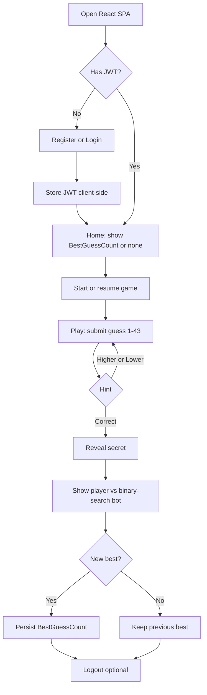

---

## 2. Decisions already made

| Topic | Decision |
|--------|----------|
| Solution name | `AbpGuessGame` |
| Architecture | **Modular monolith**: one ABP HTTP API + React SPA + one PostgreSQL database |
| UI | React (TypeScript + Vite), not Blazor/Angular |
| Auth | ABP Identity + OpenIddict JWT |
| Logging | **Serilog** (console JSON; optional file locally) |
| Cloud | **Cloud-agnostic**. No AWS services as dependencies |
| Bonus | Binary-search bot race |
| Docs | This file first; per-step markdown when implementation starts |
| Code start | Only after this plan is accepted |
| Tests | xUnit + NSubstitute + Shouldly (ABP style); domain unit tests first; React unit tests with Vitest |

---

## 3. What we are not building

Out of scope unless explicitly requested later:

- Microservices, API gateways (YARP/Ocelot), RabbitMQ, Redis as a **requirement**
- AWS Shield, WAF, CloudFront, X-Ray, Secrets Manager, RDS Proxy as **required** pieces
- Blazor or Angular UI
- Public leaderboards, chat, multiplayer sockets
- Terraform/CDK as part of v1 (optional later)

**Note on DDoS:** a huge volumetric flood is a **platform/network** problem (Heroku router, Azure Front Door, Cloudflare, etc.). The **application** still rate-limits, authenticates, and times out so it does not destroy itself under a request storm. We do not design the app around AWS Shield.

---

## 4. Architecture

### 4.1 Logical view

**Context (who talks to what)**

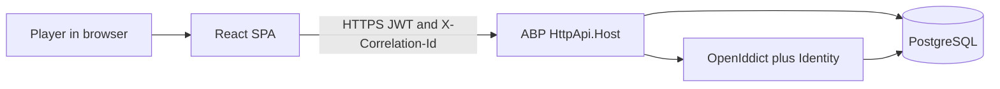

**Containers (processes)**

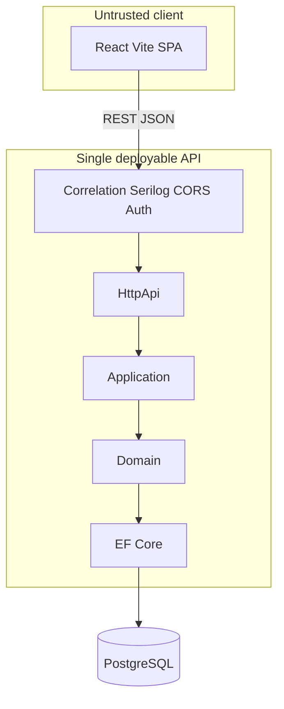

**ASCII (same as the charts)**

```text
┌─────────────────────────────────────────┐
│  React SPA (Vite)                       │
│  - Auth screens                         │
│  - Game UI                              │
│  - Creates X-Correlation-Id             │
│  - Client-side operation logs           │
└─────────────────┬───────────────────────┘
                  │ HTTPS + Bearer JWT
                  │ Header: X-Correlation-Id
┌─────────────────▼───────────────────────┐
│  AbpGuessGame.HttpApi.Host              │
│  ┌───────────────────────────────────┐  │
│  │ HttpApi (contracts / controllers) │  │
│  │ Application (use cases)           │  │
│  │ Domain (Game, Guess, rules)       │  │
│  │ EF Core + PostgreSQL              │  │
│  │ Serilog + correlation middleware  │  │
│  │ Identity + OpenIddict             │  │
│  └───────────────────────────────────┘  │
└─────────────────┬───────────────────────┘
                  │
         ┌────────▼────────┐
         │   PostgreSQL    │
         └─────────────────┘
```

### 4.2 Why modular monolith

The brief is one bounded context (guessing) plus identity. Extra services, gateways, and message buses would look like over-engineering. Game logic still lives in its **own ABP module** so it could be extracted later without rewriting the domain.

### 4.3 Trust boundary

- React is untrusted. It never talks to PostgreSQL.
- The API is the only process that reads/writes the database.
- The secret number is a **domain invariant**, not a UI concern.

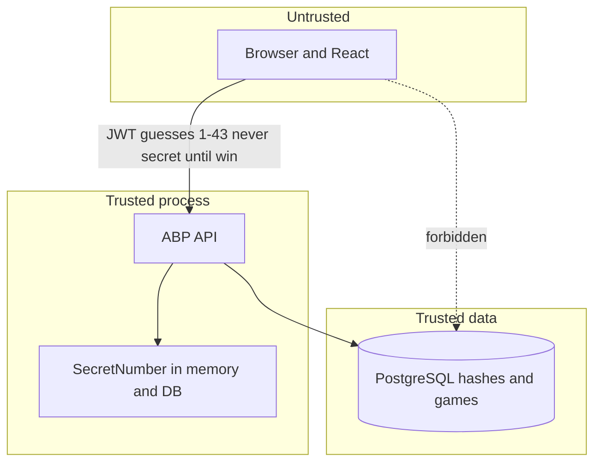

### 4.4 Runtime locally vs any host

| Environment | How it runs |
|-------------|-------------|
| Local | `docker-compose` (PostgreSQL) + `dotnet run` + `npm run dev` |
| Heroku | Web dyno (API; or API + static) + Heroku Postgres + config vars + **stdout logs** |
| Azure | App Service (or Container Apps) + Azure Database for PostgreSQL + App Settings |
| Other | Any Docker host; same images, env vars, stdout |

Serilog writes **JSON to the console**. Every major platform can drain stdout. No vendor log SDK required.

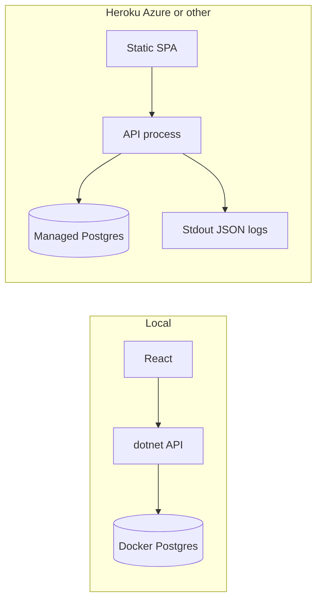

---

## 5. Solution structure

Planned layout (created when coding starts, not now):

```text
AbpGuessGame/
  DOCUMENTATION.md                 ← this file
  README.md                        ← short pointer + how to run (when code exists)
  docs/
    README.md                      ← index of step docs
    steps/
      01-bootstrap.md
      02-identity-auth.md
      03-game-domain.md
      04-game-application-api.md
      05-react-auth.md
      06-react-game.md
      07-serilog-correlation.md
      08-security-hardening.md
      09-runbook.md
  src/
    AbpGuessGame.Domain.Shared/
    AbpGuessGame.Domain/
    AbpGuessGame.Application.Contracts/
    AbpGuessGame.Application/
    AbpGuessGame.EntityFrameworkCore/
    AbpGuessGame.HttpApi/
    AbpGuessGame.HttpApi.Host/
  react/
    src/
  test/
    AbpGuessGame.Domain.Tests/
    AbpGuessGame.Application.Tests/
    AbpGuessGame.EntityFrameworkCore.Tests/
    AbpGuessGame.HttpApi.Tests/
  docker-compose.yml
```

ABP layers we will keep strict:

| Project | Responsibility |
|---------|----------------|
| Domain.Shared | Enums, constants (min/max 1–43), error codes |
| Domain | `Game` aggregate, guess recording, win, best-score rule |
| Application.Contracts | DTOs, `IGameAppService` |
| Application | Use cases, authorization, mapping, UoW |
| EntityFrameworkCore | DbContext, mappings, migrations |
| HttpApi | REST exposure of application services |
| HttpApi.Host | Pipeline: auth, CORS, Serilog, correlation, Swagger |

**Project dependencies (compile-time, inner layers do not reference outer)**

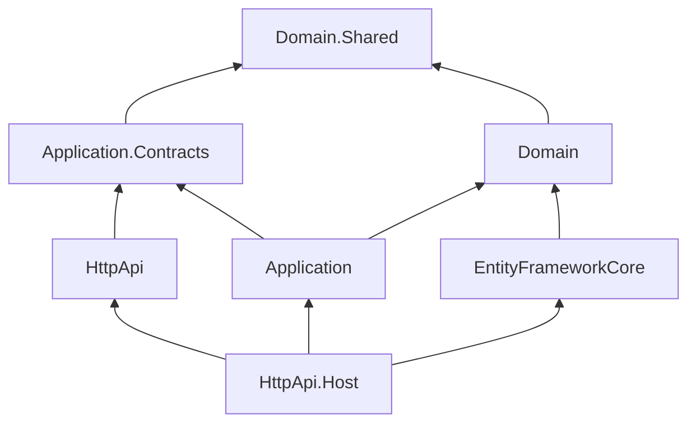

**HTTP pipeline (order of middleware, conceptual)**

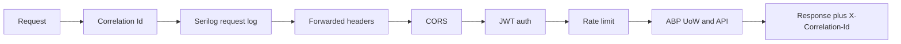

---

## 6. Technology stack

| Area | Choice |
|------|--------|
| Runtime | .NET 8 or 9 (whatever current ABP CLI templates pin) |
| Framework | ABP Framework (open source), **app** template, **no bundled UI** |
| API | REST, ABP application services + conventional controllers |
| Auth | OpenIddict, JWT Bearer |
| ORM | EF Core |
| Database | PostgreSQL |
| Frontend | React 18+, TypeScript, Vite |
| HTTP client (SPA) | fetch or axios with interceptors |
| Logging | Serilog + ABP Serilog integration |
| Enrichers | Correlation id, user id, environment, machine/process |
| Sinks | Console (JSON). Optional rolling file in Development |
| Containers | Docker Compose for Postgres (and optionally API) |
| Backend tests | xUnit, NSubstitute (or Moq), Shouldly, ABP test base |
| Frontend tests | Vitest + React Testing Library |
| Test data | Fixed secrets via injectable `IRandomNumberGenerator` so domain tests are deterministic |

---

## 7. Domain design

### 7.1 User (Identity + one extra field)

ABP `IdentityUser` extended with:

| Field | Type | Meaning |
|-------|------|---------|
| `BestGuessCount` | `int?` | Lowest number of guesses that **won** a round. `null` = never won |

**Update rule:** on win, if `BestGuessCount` is null **or** current game `GuessCount < BestGuessCount`, set `BestGuessCount = GuessCount`. This is the **only** persistent “high score” field required by the brief.

**Invariant:** `Status == Won` implies `GuessCount >= 1`. A win can never occur with `GuessCount == 0`, since the winning guess itself is the increment — there is no way to "start already won."

### 7.2 Game aggregate

| Field | Type | Notes |
|-------|------|--------|
| `Id` | Guid | |
| `UserId` | Guid | Owner |
| `SecretNumber` | int | 1–43, **never** in DTOs until status is terminal |
| `GuessCount` | int | Increments per accepted guess |
| `Status` | enum | `InProgress`, `Won`, `Abandoned` |
| `BotGuessCount` | int | Binary-search guesses needed for this secret (computed at start) |
| `ConcurrencyStamp` / row version | string/byte | Optimistic concurrency |
| `CreationTime` | DateTime | |

**Invariant:** at most **one** `InProgress` game per user. Start resumes that game instead of inserting another (prevents row flooding).

**Entity relationship**

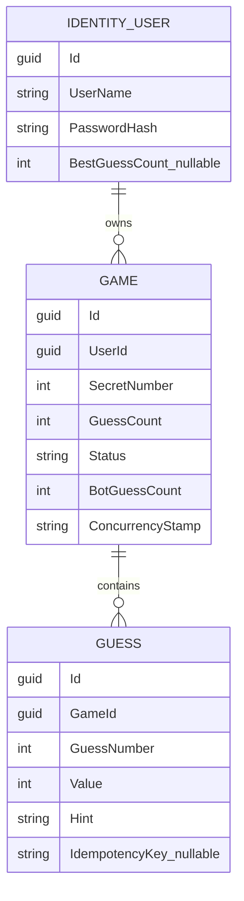

### 7.3 Guess (child entity / collection) — the durable guess log

| Field | Type | Notes |
|-------|------|--------|
| `Id` | Guid | |
| `GameId` | Guid | |
| `GuessNumber` | int | 1-based ordinal within the game; set to the pre-increment `GuessCount + 1` at insert time. Makes replay order explicit instead of relying on `CreationTime` sort |
| `Value` | int | 1–43 |
| `Hint` | enum | `Higher`, `Lower`, `Correct` |
| `IdempotencyKey` | string? | See §7.4 idempotency rule; nullable, unique per `GameId` when set |
| `CreationTime` | DateTime | |

**This table is the business log of every guess a user makes — not just the `GuessCount` integer.** It is mandatory, not optional history:

> Every accepted guess **MUST** result in exactly one persisted `Guess` row, written in the **same unit of work** as the `Game` update, before `SaveChanges`. Serilog (§12) is the *flow/ops* log; this table is the *business* log — the app needs both, and neither substitutes for the other.

`Guess` rows are **immutable and never deleted**, including for abandoned games (see §7.4) — they are the audit trail for "what did this user actually guess, in order," and are also what powers the player-vs-bot history in the bonus feature (§10) via the history endpoint (§8.2).

### 7.4 Domain behavior

**Start game**

- If in-progress game exists → return it (without secret).
- Else generate `SecretNumber` uniformly in `[1, 43]`.
- Simulate binary search; store `BotGuessCount`.
- Status = `InProgress`.

**Record guess**

- Must be owner, status `InProgress`, value in 1–43.
- **Idempotency:** if the request carries an `Idempotency-Key` (or reuses `X-Correlation-Id`, since that's already one-per-action per §12.2) matching an existing `Guess.IdempotencyKey` for this game, skip domain logic entirely and return the previously computed `GuessResultDto`. This protects against double-submit from a retried network request or a double-tap on mobile.
- **Duplicate value in this game:** if `value` matches any prior `Guess.Value` for the current game, reject **without** incrementing `GuessCount` and **without** inserting a new `Guess` row. Return the original hint again with `alreadyGuessed: true` on the DTO, and log `Game.DuplicateGuessIgnored` at Warning level (fields: `value`, current `guessNumber`). This exists so a careless UI (or replayed requests) can't inflate `GuessCount`/`BestGuessCount` by re-sending an already-tried number.
- Otherwise: increment `GuessCount`, insert the `Guess` row (`GuessNumber = GuessCount`), log `Game.GuessPersisted` (fields: `gameId`, `guessNumber`, `value`, `hint`) immediately after the row is added and before `SaveChanges`.
- Compare to secret → hint.
- If equal: status `Won`; apply best-score rule on the user.

**Abandon** (optional): set `Abandoned` if we ever allow “new game” while one is open. Prefer resume for v1. `Guess` rows belonging to an abandoned game are **kept** (never deleted) and simply excluded from "current game" queries once `Status != InProgress`; `BestGuessCount` is untouched.

**Game status**

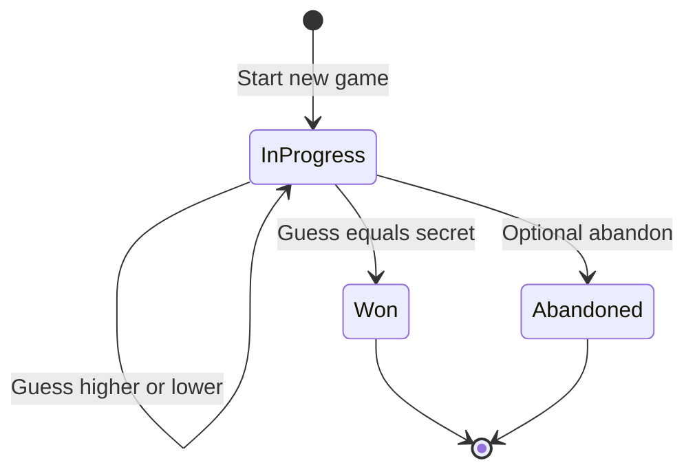

**Record-guess decisions**

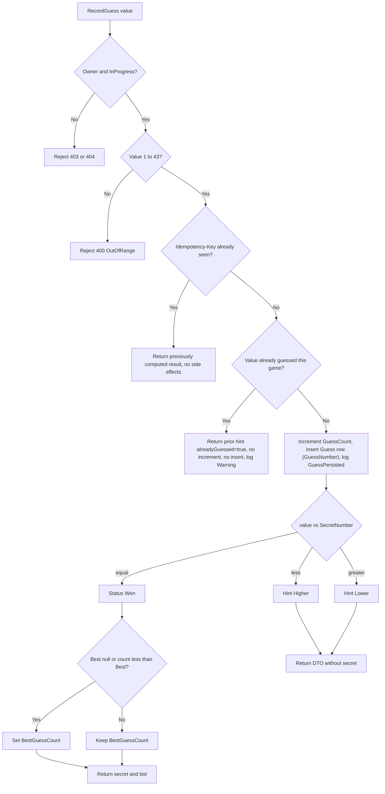

---

### 7.5 Binary-search bot (domain, pure)

Inclusive range:

```text
low = 1, high = 43, count = 0
while low <= high:
  mid = (low + high) / 2   // integer division
  count++
  if mid == secret: return count and path
  if mid < secret: low = mid + 1
  else: high = mid - 1
```

Same secret as the player. Deterministic. No I/O. Computed **before** `SaveChanges` so the transaction stays short.

**Testability:** secret generation is **not** `new Random()` inside `Game`. The domain depends on `ISecretNumberGenerator` so unit tests inject a fixed value (see [section 16](#16-testing-plan-unit-application-api-ui)).

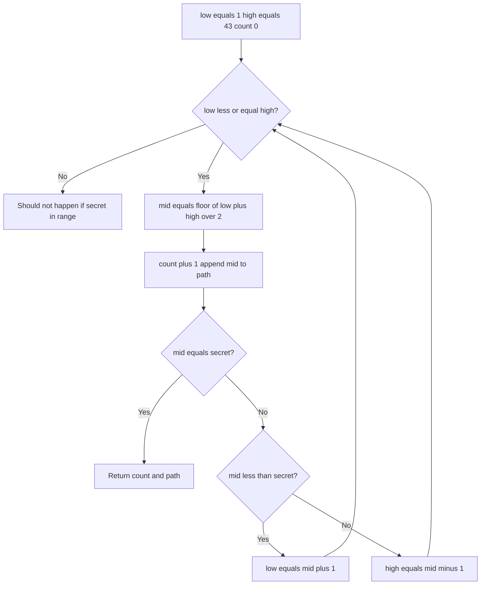

---

### 7.6 What must never leak from domain to client early

- `SecretNumber` while `Status == InProgress`
- Password hashes
- Internal exception details

---

## 8. REST API design

All game endpoints require JWT. ABP conventional routes may differ slightly; names below are the **contract we intend**.

### 8.1 Account

| Action | Typical ABP surface |
|--------|---------------------|
| Register | Account register API |
| Login | OpenIddict token endpoint (password / or ABP login that returns token) |
| Logout | Client drops token; optional revocation if we enable it |
| Me | Profile DTO **includes** `bestGuessCount` |

**Failure paths (previously unstated, now explicit):**

| Situation | Status | Notes |
|---|---|---|
| Username/email already taken | 400 | ABP Identity returns this natively — surface as a field-level error, not a generic message |
| Password fails policy | 400 | Use ABP Identity default policy (min length, at least one digit) unless the brief demands otherwise — the actual policy in force must be written down in `docs/steps/02-identity-auth.md` |
| Login with wrong password | 401, generic message | Never reveal whether the username exists (avoid username enumeration) |
| Repeated failed logins | Lockout (also §13.1) | e.g. 5 attempts → 5-minute lockout — pick concrete numbers, don't leave "lockout" unquantified |

**Login then profile (sequence)**

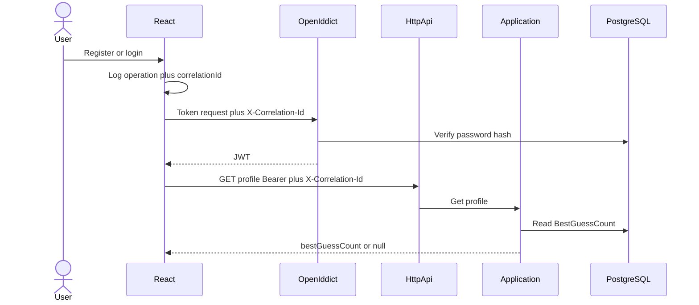

### 8.2 Game

| Method | Path (indicative) | Body | Result |
|--------|-------------------|------|--------|
| POST | `/api/app/game` | empty | Current or new game DTO (no secret) |
| GET | `/api/app/game/current` | | In-progress game or 204/404 |
| POST | `/api/app/game/{id}/guess` | `{ "value": 20 }`, header `Idempotency-Key` (or reuse `X-Correlation-Id`) | Guess result DTO |
| GET | `/api/app/game/{id}/guesses` | | Ordered list of `GuessHistoryItemDto` for that game, owner only — the persisted guess log from §7.3, for rendering history and the player-vs-bot comparison (§10) |

**`GuessHistoryItemDto`:** `guessNumber, value, hint, creationTime` — never includes `secretNumber` while `Status == InProgress` (same leak rule as §7.6).

**Guess through layers (sequence)**

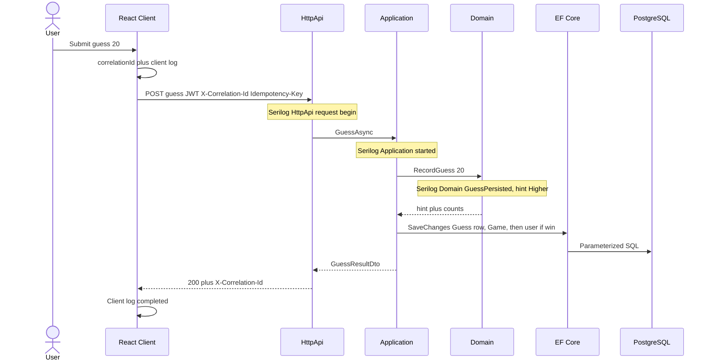

### 8.3 DTOs

**GameDto (in progress)**

- `id`, `guessCount`, `status`, `creationTime`
- **no** `secretNumber`, **no** `botGuessCount` until won (or include bot count only after win — either is fine; **secret** stays hidden)

**GuessInput**

- `value`: int

**GuessResultDto**

- `value`, `hint` (`Higher` \| `Lower` \| `Correct`)
- `guessCount`
- `won` (bool)
- `alreadyGuessed` (bool) — true when the same value was already tried this game; count and history are unchanged
- if won: `secretNumber`, `botGuessCount`, `beatTheBot`, `bestGuessCount`, optional `botPath: number[]`

### 8.4 HTTP semantics

| Situation | Status |
|-----------|--------|
| Validation (not 1–43) | 400 |
| Not authenticated | 401 |
| Not owner | 403 |
| Game missing / not in progress | 404 |
| Concurrent update conflict | 409 |
| Rate limit exceeded | 429 |
| Success | 200 |

ABP problem-details JSON for errors. Include `correlationId` in the payload or header so the UI can display it.

### 8.5 CRUD mapping (interview language)

| Resource | Operations |
|----------|------------|
| Users / credentials | Create (register), read (profile), update password if Identity supports it; no delete required |
| Games | Create (start), read (current), update (via guess) |
| Guesses | Create (each guess, persisted — §7.3); read as history via `GET /game/{id}/guesses` |
| Best score | Not a separate resource: **one column** updated on win |

---

## 9. React client design

### 9.1 Screens

1. **Register / Login**
2. **Home (authenticated)** — show `BestGuessCount` or “No best yet”. Start/continue. Logout.
3. **Play** — number input, submit, higher/lower, running guess count. No secret in state from the start response.
4. **Result** — secret revealed, player vs bot, celebrate if `beatTheBot`.

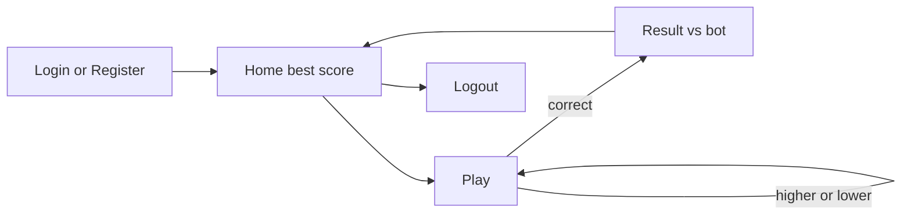

### 9.2 Client responsibilities for tracing

On **every** user operation (login, register, start game, guess, load profile):

1. Ensure a `correlationId` (UUID). Reused as the `Idempotency-Key` for guess submissions (§7.4) since it is already generated one-per-action.
2. Log locally: `{ operation, correlationId, timestamp }`.
3. Send header `X-Correlation-Id`.
4. On response, log `{ operation, correlationId, status }`.
5. On error, show a generic message and the **correlation id** (for support / demo).

Token: memory or `sessionStorage`. Never localStorage if we can avoid it (XSS). Never put connection strings in the SPA.

### 9.3 CORS

API allows only the React origin(s) from configuration (`App:CorsOrigins`).

---

## 10. Bonus: binary-search bot race

- At game start, domain computes `BotGuessCount` (and optionally the list of mids).
- Player plays as usual.
- On win, UI compares `guessCount` vs `botGuessCount`.
- If player ≤ bot: they “beat or matched optimal search” (luck on early hit is allowed).
- Optional: display the bot’s guess sequence so an interviewer sees the algorithm, alongside the player's actual guess sequence pulled from `GET /game/{id}/guesses` (§8.2) — the persisted guess log doubles as the data source for this comparison.

This is extra; the brief still works if the interviewer only checks CRUD + higher/lower + best score.

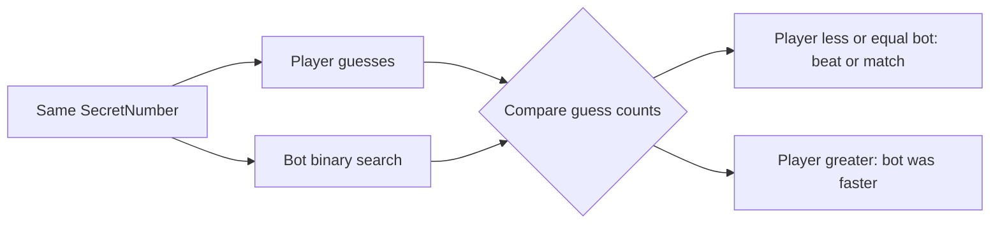

---

## 11. Configuration and 12-factor deploy

All environments use **environment variables** (or ABP `appsettings` overridden by env):

| Setting | Purpose |
|---------|---------|
| `ConnectionStrings__Default` | PostgreSQL (Heroku may use `DATABASE_URL` — map at startup) |
| `App__CorsOrigins` | React URL |
| `AuthServer__Authority` / OpenIddict URLs | Tokens |
| `ASPNETCORE_ENVIRONMENT` | Development / Production |
| `Serilog__MinimumLevel` | Log verbosity |

**Secrets:** never in git. Platform config vars (Heroku), App Settings (Azure), `.env` local (gitignored).

**Health:** `GET /health` for any load balancer.

**HTTPS:** terminated at the platform; API `UseForwardedHeaders` when behind a proxy (Heroku/Azure).

---

## 12. Logging and tracing (Serilog, every layer)

### 12.1 Goal

Follow **one operation** from the button click to the domain rule using a single **CorrelationId**. Serilog is the system of record on the server. The client logs the same id so the two sides join.

### 12.2 Correlation id

1. React generates or reuses `X-Correlation-Id` (GUID) per **user action** (one guess = one id). This same value doubles as the `Idempotency-Key` for guess submissions (§7.4).
2. API middleware:
   - If header present → use it (validate GUID format; if invalid, generate new).
   - If missing → generate.
   - Push into `LogContext` (`CorrelationId`).
   - Return the same value on response header `X-Correlation-Id`.
3. Application and Domain do not pass the id through every method: they use **Serilog ambient context** (and ABP `ILogger<T>`).
4. Optional: store correlation id on ABP audit log extra properties.

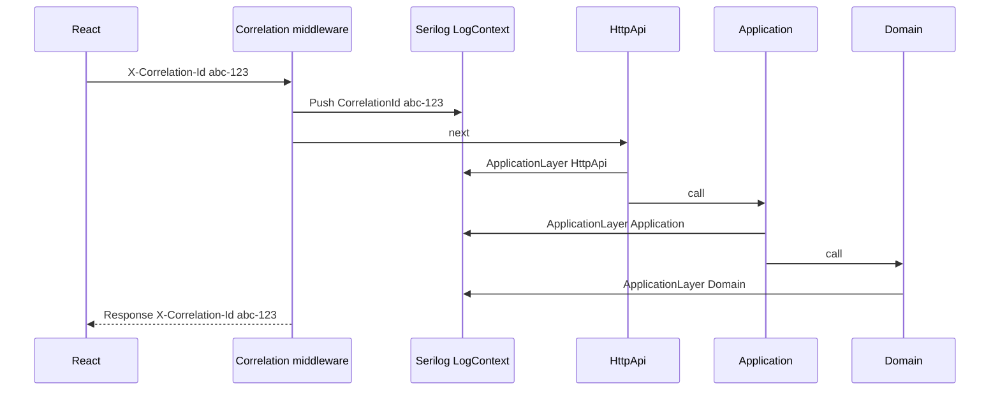

Grep `abc-123` across stdout and the browser console to replay the whole operation.

### 12.3 Serilog setup (intended)

- `UseSerilog()` on the host
- Enrichers: `FromLogContext`, `WithMachineName`, `WithEnvironmentName`, `WithThreadId`
- Properties always present when possible: `CorrelationId`, `UserId`, `RequestPath`, `Operation`, `ApplicationLayer`
- Output: **compact JSON** to **Console**
- Development: optional file sink under `Logs/`
- Request logging: Serilog request logging middleware (method, path, status, elapsed ms)
- **Do not** log request bodies for login/register
- **Do not** log `SecretNumber` at Information while game is in progress (Debug-only behind a flag is discouraged for interviews; just never log it)

### 12.4 Property `ApplicationLayer`

Every log line from our code should set one of:

- `Client` (React — browser console / debug panel)
- `HttpApi`
- `Application`
- `Domain`
- `Infrastructure` (EF / retries)

So a filter `ApplicationLayer = Domain` and `CorrelationId = …` shows only domain steps.

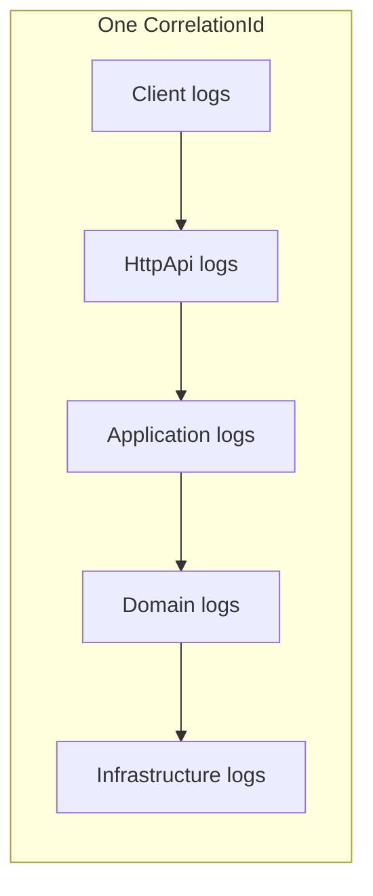

### 12.5 What each layer logs

#### Client (React)

| Event | Fields |
|-------|--------|
| Operation started | `operation`, `correlationId` |
| HTTP request | `method`, `url`, `correlationId` |
| HTTP response | `status`, `correlationId`, `elapsedMs` if easy |
| Operation failed | `status`, `correlationId`, `errorCode` (not stack of API) |

Operations: `Register`, `Login`, `Logout`, `LoadProfile`, `StartGame`, `Guess`, `ShowResult`.

#### HttpApi

| Event | Level | Fields |
|-------|-------|--------|
| Request begin | Information | method, path, `Operation` |
| Model validation fail | Warning | reason |
| Request end | Information | status, elapsed |
| Unhandled exception | Error | exception (no secret) |

`Operation` examples: `Game.Start`, `Game.Guess`, `Account.Login`.

#### Application (`*AppService`)

| Event | When |
|-------|------|
| `GuessAsync started` | Entry |
| `Game loaded` | After repository get (id, status, **not** secret) |
| `Guess recorded` | After domain call (hint, guessCount, won) |
| `Best score updated` | If user field changed (old → new count) |
| `GuessAsync completed` | Exit |
| `Deadlock retry` | Warning, attempt n |
| Authorization failed | Warning |

#### Domain (`Game`, domain services)

Every guess a user makes is logged here — this is the layer where the decision and the write are recorded, alongside the persisted `Guess` row from §7.3:

| Event | When |
|-------|------|
| `Game.Created` | New aggregate (log id, userId, **not** secret) |
| `Game.GuessRecorded` | value, hint, guessCount — the decision |
| `Game.GuessPersisted` | gameId, guessNumber, value, hint — confirms the `Guess` row write, immediately before `SaveChanges` |
| `Game.DuplicateGuessIgnored` | Warning; value, guessNumber — a repeat guess was rejected without counting (§7.4) |
| `Game.Won` | guessCount, botGuessCount |
| `Game.RejectedGuess` | reason (out of range, not in progress) |
| `BestGuessCount.Changed` | userId, new value |

Domain logs **decisions**, not HTTP.

#### Infrastructure

| Event | When |
|-------|------|
| EF save failed with `40P01` | Warning + retry |
| EF save succeeded | Debug/Information in Development |

### 12.6 End-to-end example: Guess value `20`

`CorrelationId = 3fa85f64-5717-4562-b3fc-2c963f66afa6`

```text
[Client]        operation=Guess started
[Client]        HTTP POST /api/app/game/{id}/guess
[HttpApi]       Request begin Operation=Game.Guess
[Application]   GuessAsync started gameId=… value=20
[Domain]        Game.GuessRecorded value=20 hint=Higher guessCount=3
[Domain]        Game.GuessPersisted gameId=… guessNumber=3 value=20 hint=Higher
[Application]   Guess recorded won=false
[Application]   GuessAsync completed
[HttpApi]       Request end 200 elapsedMs=12
[Client]        HTTP 200 operation=Guess completed
```

If domain rejects value `0`:

```text
[Client]        operation=Guess started
[HttpApi]       Request begin
[Application]   GuessAsync started
[Domain]        Game.RejectedGuess reason=OutOfRange
[Application]   → throws business exception
[HttpApi]       400 + correlation id
[Client]        HTTP 400 show correlation id
```

If the same value is guessed twice:

```text
[Client]        operation=Guess started
[HttpApi]       Request begin
[Application]   GuessAsync started value=20
[Domain]        Game.DuplicateGuessIgnored value=20 guessNumber=3
[Application]   Guess recorded won=false alreadyGuessed=true
[HttpApi]       Request end 200 elapsedMs=8
[Client]        HTTP 200 alreadyGuessed=true
```

Same GUID in every line. That is the tracing model (**log-based tracing**). We do not require OpenTelemetry or AWS X-Ray. OTEL can be added later as a sink; it is **not** a dependency.

### 12.7 Operation catalog

| Operation | Client | HttpApi | Application | Domain |
|-----------|:------:|:-------:|:-----------:|:------:|
| Register | ✓ | ✓ | Identity app | User created |
| Login | ✓ | ✓ | Identity | (never log password) |
| Logout | ✓ | optional | optional | — |
| LoadProfile | ✓ | ✓ | ✓ | read best |
| StartGame | ✓ | ✓ | ✓ | Game.Created or resume |
| Guess | ✓ | ✓ | ✓ | GuessRecorded / GuessPersisted / DuplicateGuessIgnored / Won |
| Best score update | (via result) | ✓ | ✓ | BestGuessCount.Changed |

### 12.8 Log levels

| Level | Use |
|-------|-----|
| Verbose/Debug | EF SQL in Development only |
| Information | Happy-path operation steps |
| Warning | Validation, retries, authz deny, duplicate guesses |
| Error | Unexpected exceptions |

### 12.9 PII and secrets policy

**Never log:**

- Passwords, tokens, cookies, connection strings
- `SecretNumber` while in progress
- Full request bodies on account endpoints

**May log:** user id (guid), game id, guess **value** (it’s the player’s input), hints, counts.

### 12.10 ABP audit logging

Enable audit for application service methods (who, when, URL, duration). Serilog is for **flow**; audit is for **accountability**; the persisted `Guess` table (§7.3) is for **business history**. All three can share the correlation id if we copy it into extra properties.

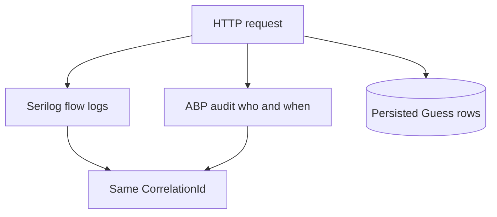

---

## 13. Security (application-owned)

Platforms may add WAF/CDN later. **v1 security is in the app.**

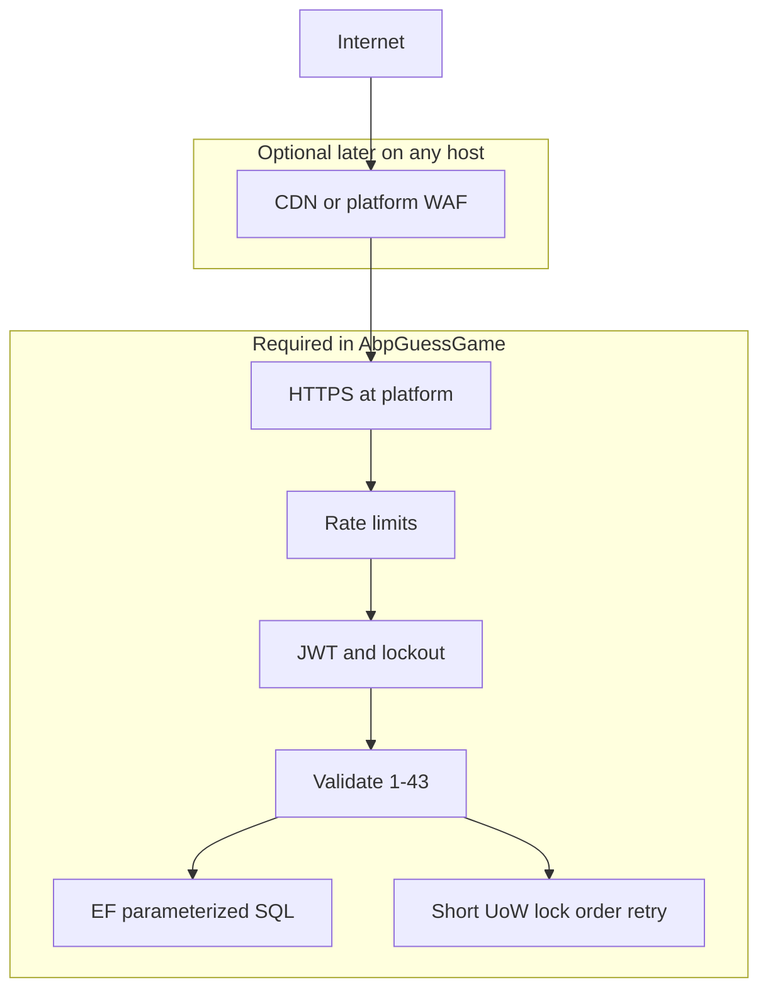

### 13.1 Authentication and credentials

- Identity password hashing (not reversible storage)
- JWT on all game APIs
- HTTPS in production (platform)
- Lockout after repeated failed logins: **5 failed attempts → 5-minute lockout** (Identity options; a concrete number, not left open)
- CORS allowlist

### 13.2 Request abuse (application stand-in for “DDoS protection”)

We cannot stop a terabit flood. We **can**, with concrete numbers:

| Endpoint | Limit | Scope |
|---|---|---|
| Token/login | 5 requests / minute | per IP + per username |
| `POST /guess` | 20 requests / minute | per authenticated user |
| `POST /game` (start) | 5 requests / minute | per authenticated user |

Exceeding returns `429` with `Retry-After`; log at Warning with `ApplicationLayer=HttpApi`, `Operation`, `CorrelationId`.

Also:

- Require JWT so anonymous clients cannot create games
- One in-progress game per user
- Kestrel / request timeouts and max body size (guess JSON is tiny)
- Do not do expensive work before auth

Document for interviewers: volumetric DDoS = host/CDN; application still sheds load.

### 13.3 Deadlocks (PostgreSQL + EF)

**Risk:** updating `Game` and `BestGuessCount` in inconsistent order.

**Application rules:**

1. One ABP unit of work per HTTP request
2. Always update **Game and its Guess row first**, then user **BestGuessCount**
3. Compute bot **before** `SaveChanges`
4. No HTTP calls inside a transaction
5. Optimistic concurrency on `Game`
6. On `PostgresException.SqlState == "40P01"`, retry UoW 2–3 times with jitter; log each retry with correlation id
7. Index `IX_Games_UserId_Status`
8. React never holds a DB transaction

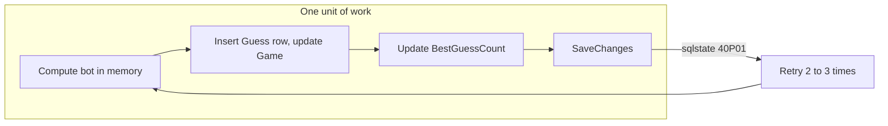

### 13.4 SQL injection

- EF Core LINQ only for normal queries
- No string-concatenated SQL
- If raw SQL ever appears: parameterized APIs only (`FromSqlInterpolated` / parameters)
- Guess validated as integer 1–43 **before** persistence
- SPA has no database driver and no connection string

```mermaid
flowchart TD
  Body[JSON body value] --> Bind[Model bind to int]
  Bind --> Range[Must be 1 to 43]
  Range -->|fail| Bad[400 no SQL]
  Range -->|ok| Linq[EF Core LINQ parameters]
  Linq --> PG[(PostgreSQL)]
  SPA[React] -.->|no connection string| PG
```

### 13.5 Game integrity

- Secret only on server until win
- Server validates range and ownership
- Best score only updates on **win**, never on abandon
- Duplicate and idempotent-replay guesses never move `GuessCount` or `BestGuessCount` (§7.4)

### 13.6 Headers and pipeline

- Correlation id middleware
- Forwarded headers behind Heroku/Azure
- Security headers on API responses where useful (`X-Content-Type-Options`, etc.)
- Swagger disabled or protected in Production

---

## 14. Documentation at every step

### 14.1 Rule

No implementation step without a markdown file that states: goal, tasks, logging/security notes, done criteria. After the step, tick the criteria. If behavior changes, update **this** `DOCUMENTATION.md` too.

### 14.2 Step files (to create when coding starts)

| File | Step |
|------|------|
| `docs/steps/01-bootstrap.md` | ABP solution, Postgres, gitignore |
| `docs/steps/02-identity-auth.md` | Register/login/logout, JWT, CORS, **actual password policy in force** |
| `docs/steps/03-game-domain.md` | Entities, invariants, bot, duplicate/idempotency rules |
| `docs/steps/04-game-application-api.md` | App services, DTOs, REST, guess history endpoint |
| `docs/steps/05-react-auth.md` | SPA login/register, correlation header |
| `docs/steps/06-react-game.md` | Play UI, best score, bot result |
| `docs/steps/07-serilog-correlation.md` | Serilog JSON, layers, e2e grep demo |
| `docs/steps/08-security-hardening.md` | Rate limit numbers, deadlock retry, validation |
| `docs/steps/09-runbook.md` | Run locally; deploy notes Heroku vs Azure |
| `docs/steps/10-unit-tests.md` | Domain/application/API/React tests; CI command |

Each step file template:

```markdown
# Step N — title
## Goal
## Tasks
## Logging (client / api / application / domain)
## Security
## Unit tests (what to add this step)
## Done when
## Notes / deviations from DOCUMENTATION.md
```

---

## 15. Implementation order (after accept)

Do not start until the plan is accepted.

1. Keep this file as source of truth; add `docs/steps/*`
2. Bootstrap ABP API + Docker PostgreSQL
3. Identity: register, login, logout, hashed passwords, lockout numbers, uniqueness/policy errors
4. Extend user with `BestGuessCount`; Game module domain + EF + migrations, including `Guess.GuessNumber` and `Guess.IdempotencyKey`
5. Application + HttpApi + Swagger, including guess history endpoint
6. Serilog + correlation middleware (can be earlier; must exist before React e2e)
7. React auth + profile best score
8. React game + bot result
9. Rate limits (concrete numbers), deadlock retry, hardening
10. Tests: domain unit tests written **with** the domain (not after everything); application and API tests after services exist; React tests with UI
11. Runbook: env vars for Heroku and Azure (no AWS requirement)

```mermaid
flowchart TD
  P[Plan accepted] --> D[docs steps markdown]
  D --> B[Bootstrap API and Postgres]
  B --> I[Identity auth]
  I --> G[Game domain and EF]
  G --> UT[Domain unit tests]
  UT --> A[Application and HttpApi]
  A --> AT[Application and API tests]
  AT --> L[Serilog correlation]
  L --> R[React auth and game]
  R --> RT[React unit tests]
  RT --> S[Rate limit deadlock retry]
  S --> H[Runbook Heroku Azure]
```

---

## 16. Testing plan (unit, application, API, UI)

Tests are part of the product, not an afterthought. **Domain unit tests** are mandatory for game rules. Outer tests prove wiring, auth, and the SPA. We do not need a huge E2E suite for the interview; we do need **fast, deterministic unit tests** that match the design.

### 16.1 Test pyramid

```mermaid
flowchart TB
  subgraph Few["Fewer, slower"]
    E2E[Manual plus optional Playwright]
    Api[HttpApi integration tests]
  end
  subgraph Mid["Application tests"]
    AppT[AppService tests with mocked repos]
  end
  subgraph Many["Many, fast, no database"]
    DomT[Domain unit tests]
    BotT[BinarySearchBot unit tests]
    ReactT[React unit tests Vitest]
  end
  E2E --> Api --> AppT --> DomT
  AppT --> ReactT
  DomT --> BotT
```

| Layer | Project | Runs against | Speed | Required for v1 |
|-------|---------|--------------|-------|-----------------|
| Domain unit | `AbpGuessGame.Domain.Tests` | Aggregates, bot, range rules | Fast | **Yes** |
| Application | `AbpGuessGame.Application.Tests` | App services, fakes/mocks | Fast | **Yes** |
| EF / API | `*.EntityFrameworkCore.Tests`, `*.HttpApi.Tests` | Test Postgres or ABP in-memory/SQLite if ABP allows; otherwise Testcontainers PostgreSQL | Medium | Yes for critical paths |
| React unit | `react` Vitest | Components and API client with mocked fetch | Fast | **Yes** for hint UI and best-score display |
| Manual E2E | Interview script | Real API + UI | Slow | **Yes** as a checklist |
| Playwright | optional | Browser | Slow | Optional |

### 16.2 Principles

- **Deterministic games:** do not call `Random` inside domain logic directly. Inject `ISecretNumberGenerator` (or similar). Tests pass a **fixed** secret (for example `20`). Production uses a crypto-strong random in `[1, 43]`.
- **No network in unit tests.** Domain and most application tests must not require PostgreSQL.
- **One assertion theme per test** (name describes the rule): `RecordGuess_WhenValueTooLow_ReturnsHintHigher`.
- **Arrange–Act–Assert.** Shouldly (`ShouldBe`) to match common ABP samples.
- **Do not assert log text as the only proof** of business rules. Optionally assert that a test `ILogger` received `CorrelationId` in application tests.
- Tests live in `test/` (or ABP default `test/` next to `src/`). Naming: `*Tests` class, `*Async` when testing async app services.

### 16.3 Domain unit tests (`AbpGuessGame.Domain.Tests`)

These are the core of the interview: they prove higher/lower, win, one best-score field, and the bot.

**`Game` aggregate**

| Test | Expected |
|------|----------|
| Create with secret `1` and `43` | Valid; status `InProgress`; `GuessCount` 0 |
| Create with secret `0` or `44` | Domain exception |
| `RecordGuess(20)` when secret is `30` | Hint **Higher**; count 1; still `InProgress`; secret not exposed by any public “client” method if we hide it |
| `RecordGuess(20)` when secret is `10` | Hint **Lower** |
| `RecordGuess(20)` when secret is `20` | Hint **Correct**; status `Won`; count 1 |
| Guess `0`, `44`, `-1` | Reject `OutOfRange`; count unchanged |
| Guess after `Won` | Reject; no extra count |
| Guess by wrong user | Reject (if ownership is enforced in domain; otherwise application test) |
| Two guesses then win | `GuessCount` equals 3 |
| Correct value on the very first guess | `GuessCount == 1`, `BestGuessCount` set to `1` — proves the `Won ⇒ GuessCount >= 1` invariant (§7.1) |
| Guess a value already guessed earlier in the same game | Rejected; `GuessCount` unchanged; no new `Guess` row inserted; returns prior hint with `alreadyGuessed: true` |
| Same `Idempotency-Key` submitted twice | Second call returns the identical `GuessResultDto` with no additional side effects (no new row, no count change) |

**`BestGuessCount` on user** (domain service or user method)

| Test | Expected |
|------|----------|
| First win with 5 guesses | `BestGuessCount` becomes `5` |
| Second win with 3 guesses | becomes `3` |
| Second win with 10 guesses | stays `3` |
| Abandon or in-progress | field **not** updated |

**`BinarySearchBot`** (pure functions; table-driven)

| Secret | Expected count | Notes |
|--------|----------------|-------|
| `22` | computed from algorithm in this doc | Mid sequence starts at 22 for `[1,43]` — tests lock the implementation |
| `1` | worst-case-ish path length | Must find 1 |
| `43` | must find 43 | |
| Any n in 1–43 | `count >= 1` and last mid equals n | Loop invariant |

Use **theory/InlineData** for all secrets 1–43 if cheap (43 cases): bot always terminates and returns the secret as last guess.

**Secret generator fake**

```text
FakeSecretNumberGenerator(int value) : ISecretNumberGenerator
```

Production: `RandomSecretNumberGenerator` with tests that samples stay in 1–43 (many iterations) without asserting a specific number.

### 16.4 Application tests (`AbpGuessGame.Application.Tests`)

Use ABP `ApplicationTestBase` where possible. Mock repositories or use fakes.

| Test | Expected |
|------|----------|
| `StartAsync` with no game | Creates game; DTO has **no** `secretNumber` |
| `StartAsync` with in-progress game | Returns **same** id (resume); no second row |
| `GuessAsync` anonymous | Authorization exception / 401 at API |
| `GuessAsync` other user’s game | 403 |
| `GuessAsync` valid | DTO hint matches domain; still no secret if not won |
| `GuessAsync` winning guess | DTO includes secret, `botGuessCount`, `beatTheBot`, updated `bestGuessCount` |
| `GuessAsync` with a repeated value | DTO has `alreadyGuessed: true`; `guessCount` unchanged from before the call |
| `GuessHistoryAsync` | Returns rows ordered by `guessNumber`; omits `secretNumber` while `InProgress` |
| Profile | `bestGuessCount` null before first win; set after win |

Application tests **must not** put `SecretNumber` on in-progress DTOs (assert JSON shape / property null or missing).

### 16.5 Infrastructure and API tests

**EF Core:** mapping `BestGuessCount`; mapping `Guess.GuessNumber` and `Guess.IdempotencyKey` (unique per `GameId` when not null); unique “one in-progress per user” if we add a filtered unique index; migration applies on test DB.

**HttpApi / integration:**

| Test | Expected |
|------|----------|
| `POST guess` without token | 401 |
| `POST guess` `{ "value": 0 }` | 400, no 500, body is problem details |
| `POST guess` `{ "value": "1; DROP TABLE" }` | 400 (JSON type error), not a SQL error |
| `POST guess` with `X-Correlation-Id` | Response echoes the same header |
| `POST guess` twice with same `Idempotency-Key` | Second response identical to the first; only one `Guess` row exists |
| `GET game/{id}/guesses` | Returns persisted guesses in order, owner only, 403 for a different user |
| Repeated `POST guess` beyond rate limit | 429 with `Retry-After` |
| Full happy path | Register (or seed user) → token → start → guess until win → GET profile shows best → GET guesses shows full history |

Prefer **Testcontainers PostgreSQL** if integration tests need a real engine; keep them tagged `Category=Integration` so developers can run **unit-only** (`dotnet test --filter Category!=Integration`) quickly.

### 16.6 React unit tests (Vitest + Testing Library)

| Test | Expected |
|------|----------|
| Home with `bestGuessCount: null` | Copy “No best yet” |
| Home with `bestGuessCount: 4` | Shows 4 |
| Play: API returns `Higher` | UI instructs guess higher |
| Play: `Correct` | Navigates or shows result; displays secret only then |
| Play: `alreadyGuessed: true` | UI shows "you already tried this number" instead of counting it again |
| Result: `beatTheBot: true` | Celebration copy |
| API client | Sets `X-Correlation-Id` (and `Idempotency-Key`) on fetch (mock) |
| Guess input | Disables submit when value empty or out of 1–43 (client UX; server still validates) |

No real backend in these tests.

### 16.7 Security and logging tests (mapped to design)

| Concern | Test type | Proof |
|---------|-----------|--------|
| SQL injection | API | Malformed JSON / huge string → 400; EF never concatenates (code review + no raw SQL tests) |
| Range | Domain + API | 0 and 44 rejected |
| Abuse | Application or API | Repeated guesses throttled at the documented limits (§13.2) |
| Deadlock retry | Application | Fake `DbUpdateException` / Postgres `40P01` → retry then success (optional; mock UoW) |
| Secret leak | Application + API | In-progress response JSON does not contain the secret |
| Correlation | API | Echo header; optional log sink capturing `CorrelationId` |
| Guess logging | Domain + API | Every accepted guess produces exactly one `Guess` row; duplicate/idempotent replays produce zero additional rows |

### 16.8 Commands (when code exists)

```text
dotnet test                         # all backend
dotnet test --filter FullyQualifiedName~Domain.Tests
npm --prefix react test             # Vitest
```

CI (GitHub Actions / Azure Pipelines / Heroku CI — any): restore, `dotnet test`, `npm test`. No AWS-specific test cloud.

### 16.9 Manual interview script (acceptance)

1. Register → login → home shows no best.
2. Start game → guess wrong → higher or lower.
3. Win → see secret and bot comparison.
4. Logout → login → **same** best guess count.
5. Open `GET /game/{id}/guesses` (or the UI history view) → confirm every guess made is present, in order.
6. (Optional) grep one correlation id in API console logs across HttpApi, Application, Domain.

### 16.10 Definition of done for “unit testing”

- Every domain rule in section 7 has at least one unit test.
- Bot is covered for boundaries `1` and `43` plus one mid value.
- In-progress DTO leak of secret is tested and fails the build if leaked.
- Duplicate-guess and idempotent-replay rules are tested and fail the build if either inflates `GuessCount`.
- `dotnet test` for Domain + Application is green without Docker.
- Step markdown `10-unit-tests.md` lists the test names actually implemented.

---

## 17. Acceptance checklist vs interview brief

| Brief item | Plan coverage |
|------------|----------------|
| React full-stack | Section 9 |
| PostgreSQL | Sections 4–6 |
| Register/login/logout | Sections 7–8 |
| Credentials in DB | Identity hashes, section 13 |
| Random 1–43 | Domain start game |
| Higher / lower | Domain record guess |
| Lowest guesses, one field | `BestGuessCount` |
| Show on login | Profile / home |
| Bonus | Section 10 |
| Portable host | Sections 4.4, 11 |
| Serilog + follow from client | Section 12 |
| Every guess logged (flow + business log) | Sections 7.3, 7.4, 8.2, 12.5, 12.10 |
| App-level DDoS/abuse, deadlock, SQLi | Section 13 |
| Docs every step | Section 14 |
| Unit and other tests | Section 16 |
| Design charts | Sections 1.4, 4, 5, 7–13, 15, 16, 18 |

---

## 18. Chart index

| Chart | Section | Type |
|-------|---------|------|
| User journey | 1.4 | Flowchart |
| System context | 4.1 | Flowchart |
| Containers and layers | 4.1 | Flowchart |
| Trust boundary | 4.3 | Flowchart |
| Local vs any cloud | 4.4 | Flowchart |
| Project dependencies | 5 | Flowchart |
| HTTP pipeline | 5 | Flowchart |
| ER model | 7.2 | ER diagram |
| Game status | 7.4 | State diagram |
| Record guess | 7.4 | Flowchart |
| Binary-search bot | 7.5 | Flowchart |
| Login sequence | 8.1 | Sequence |
| Guess sequence | 8.2 | Sequence |
| React screens | 9.1 | Flowchart |
| Player vs bot | 10 | Flowchart |
| Correlation through layers | 12.2 | Sequence |
| One CorrelationId | 12.4 | Flowchart |
| Serilog vs audit vs guess log | 12.10 | Flowchart |
| Security layers | 13 | Flowchart |
| Deadlock-safe UoW | 13.3 | Flowchart |
| SQL injection guards | 13.4 | Flowchart |
| Implementation order | 15 | Flowchart |
| Test pyramid | 16.1 | Flowchart |

---

## Document control

| Version | Date | Notes |
|---------|------|--------|
| 1.0 | 2026-09-04 | Full plan captured from architecture discussion. No application code. Cloud-agnostic. Serilog correlation from client through domain. |
| 1.1 | 2026-09-04 | Added Mermaid charts for architecture, domain, APIs, UI, logging, security, and implementation order. |
| 1.2 | 2026-09-04 | Expanded testing plan: domain unit tests, application/API/React tests, pyramid, commands, definition of done. |
| 1.3 | 2026-09-04 | Closed business-logic gaps: every guess is now persisted as a durable `Guess` row (not just Serilog flow logs), added `GuessNumber`/`IdempotencyKey`, duplicate-guess handling, guess history endpoint, idempotent guess submission, registration/login failure paths, concrete rate-limit numbers, and the `Won ⇒ GuessCount >= 1` invariant. Matching domain/application/API tests added. |

**Next action:** product owner accepts this plan (or requests edits). Only then start `docs/steps` and code.