# AbpGuessGame

> A production-oriented full-stack **Guess-the-Number** application built with **ASP.NET Core, ABP Framework, React, TypeScript, Entity Framework Core, and PostgreSQL**, following Domain-Driven Design, modular architecture, secure API design, structured observability, and automated testing practices.

[](https://dotnet.microsoft.com/)
[](https://abp.io/)
[](https://react.dev/)
[](https://www.postgresql.org/)
[]()
[]()

---

## Table of Contents

* [Overview](#overview)
* [Key Capabilities](#key-capabilities)
* [Architecture at a Glance](#architecture-at-a-glance)
* [Why a Modular Monolith?](#why-a-modular-monolith)
* [Technology Stack](#technology-stack)
* [Solution Structure](#solution-structure)
* [Application Flow](#application-flow)
* [Domain Model](#domain-model)
* [Game Rules](#game-rules)
* [REST API](#rest-api)
* [React Client](#react-client)
* [Authentication and Authorization](#authentication-and-authorization)
* [Security](#security)
* [Observability and Correlation](#observability-and-correlation)
* [Configuration](#configuration)
* [Local Development](#local-development)
* [Database and Migrations](#database-and-migrations)
* [Testing Strategy](#testing-strategy)
* [Deployment](#deployment)
* [Engineering Decisions](#engineering-decisions)
* [Out of Scope](#out-of-scope)
* [Documentation](#documentation)
* [Acceptance Checklist](#acceptance-checklist)
* [Additional Resources](#additional-resources)

---

# Overview

**AbpGuessGame** is a full-stack Guess-the-Number application designed as a practical demonstration of enterprise application architecture using the ABP Framework.

The application combines:

* **React + TypeScript** for the user interface.
* **ASP.NET Core + ABP Framework** for the backend.
* **PostgreSQL** for persistent storage.
* **ABP Identity + OpenIddict** for authentication and token-based authorization.
* **Entity Framework Core** for persistence.
* **Serilog** for structured application logging.
* **Correlation IDs** for end-to-end request tracing.
* **Domain-driven design principles** for game/business rules.
* **Unit, application, integration, API, and UI testing**.

The design deliberately uses a **modular monolith** rather than introducing unnecessary microservices, message brokers, API gateways, or cloud-specific infrastructure.

The architecture document defines the solution as cloud-agnostic and intentionally avoids unnecessary infrastructure complexity for the size of the business domain.

---

# Key Capabilities

## Authentication

* User registration.
* Login using OpenIddict/JWT.
* Logout.
* Secure password hashing through ABP Identity.
* Authentication-protected game APIs.
* Account lockout for repeated failed login attempts.
* CORS allow-listing.

## Guess-the-Number Game

* Server-generated secret number between **1 and 43**.
* Higher/lower hints.
* Server-side game state.
* Persistent game history.
* One active game per user.
* Best score tracking through `BestGuessCount`.
* Duplicate-guess protection.
* Idempotent guess submission.

## Binary-Search Bot

The application includes an optional challenge where the player competes against a deterministic binary-search algorithm using the **same secret number**.

The bot:

1. Starts with the range `1..43`.
2. Calculates the midpoint.
3. Narrows the search range.
4. Continues until the secret is found.
5. Reports the number of guesses required.

The player's performance is then compared with the bot's optimal search.

## Observability

Every important operation can be followed through:

```text
React
  ↓
HTTP API
  ↓
Application
  ↓
Domain
  ↓
Infrastructure / PostgreSQL
```

using a shared `CorrelationId`.

The architecture distinguishes between:

* **Serilog** — operational/flow logging.
* **ABP Audit Logging** — accountability.
* **Guess table** — durable business history.

These are intentionally separate responsibilities.

---

# Architecture at a Glance

## Logical Architecture

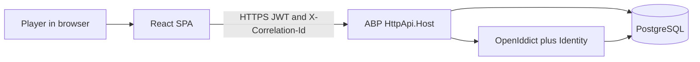

The browser is an untrusted client. It communicates only with the API and never connects directly to PostgreSQL.

---

## Runtime Architecture

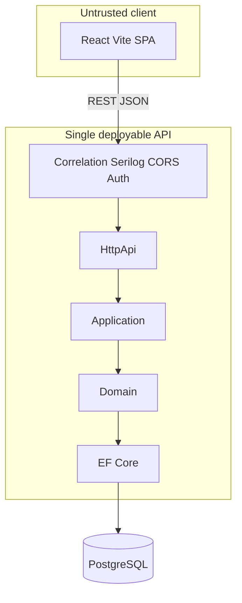

---

## End-to-End Request Pipeline

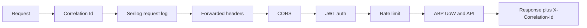

---

# Why a Modular Monolith?

The application intentionally uses a **modular monolith**.

The problem domain consists primarily of:

* Identity.
* User profile.
* Game management.
* Guess processing.
* Best-score management.

Introducing microservices, RabbitMQ, Redis, API gateways, or multiple independently deployed services would add operational and architectural complexity without providing meaningful business value for this application.

The design therefore keeps the system deployable as a single backend while maintaining strong internal boundaries.

This provides:

* Clear separation of responsibilities.
* Low operational overhead.
* Simple local development.
* Straightforward deployment.
* Strong domain boundaries.
* A future extraction path if a bounded context eventually requires independent scaling.

The game domain is intentionally isolated so it can evolve independently without turning the application into a distributed system prematurely.

---

# Trust Boundary

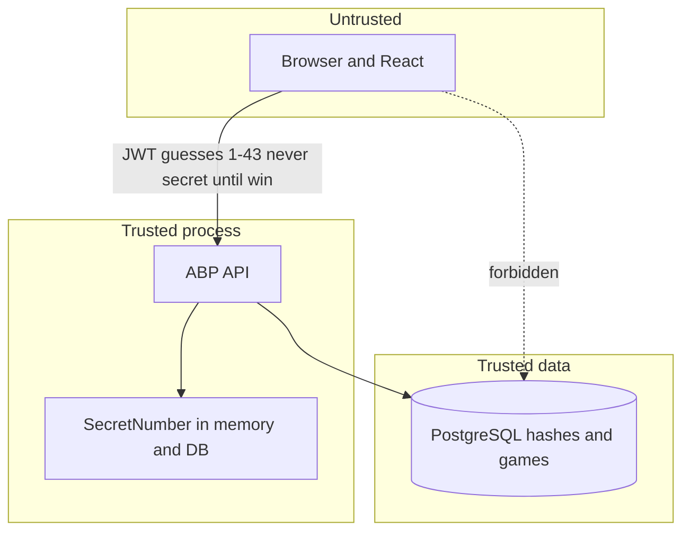

The most important security boundary is the API.

The React application:

* Does not know the secret while a game is in progress.
* Does not connect directly to the database.
* Does not contain database credentials.
* Cannot be trusted to enforce game rules.

All business-critical validation happens server-side.

---

# Technology Stack

| Area                     | Technology                                   |
| ------------------------ | -------------------------------------------- |
| Runtime                  | .NET 10                                      |
| Backend Framework        | ABP Framework                                |
| Application Architecture | Modular Monolith                             |
| Architecture Style       | Domain-Driven Design                         |
| API                      | ASP.NET Core REST / ABP Application Services |
| Authentication           | ABP Identity + OpenIddict                    |
| Authorization            | JWT Bearer                                   |
| ORM                      | Entity Framework Core                        |
| Database                 | PostgreSQL                                   |
| Frontend                 | React                                        |
| Frontend Language        | TypeScript                                   |
| Frontend Tooling         | Vite                                         |
| Logging                  | Serilog                                      |
| Correlation              | `X-Correlation-Id`                           |
| Backend Testing          | xUnit + Shouldly + NSubstitute/Moq           |
| Frontend Testing         | Vitest + React Testing Library               |
| Containers               | Docker / Docker Compose                      |
| Deployment               | Cloud-agnostic                               |

These technology choices are aligned with the architecture document's defined stack.

---

# Solution Structure

```text
AbpGuessGame/
│
├── DOCUMENTATION.md
├── README.md
│
├── docs/
│   ├── README.md
│   └── steps/
│       ├── 01-bootstrap.md
│       ├── 02-identity-auth.md
│       ├── 03-game-domain.md
│       ├── 04-game-application-api.md
│       ├── 05-react-auth.md
│       ├── 06-react-game.md
│       ├── 07-serilog-correlation.md
│       ├── 08-security-hardening.md
│       ├── 09-runbook.md
│       └── 10-unit-tests.md
│
├── src/
│   ├── AbpGuessGame.Domain.Shared/
│   ├── AbpGuessGame.Domain/
│   ├── AbpGuessGame.Application.Contracts/
│   ├── AbpGuessGame.Application/
│   ├── AbpGuessGame.EntityFrameworkCore/
│   ├── AbpGuessGame.HttpApi/
│   └── AbpGuessGame.HttpApi.Host/
│
├── react/
│   └── src/
│
├── test/
│   ├── AbpGuessGame.Domain.Tests/
│   ├── AbpGuessGame.Application.Tests/
│   ├── AbpGuessGame.EntityFrameworkCore.Tests/
│   └── AbpGuessGame.HttpApi.Tests/
│
└── docker-compose.yml
```

## Layer Responsibilities

| Layer                   | Responsibility                                                   |
| ----------------------- | ---------------------------------------------------------------- |
| `Domain.Shared`         | Constants, enums, shared domain contracts and error codes        |
| `Domain`                | Aggregates, business rules, invariants and domain behavior       |
| `Application.Contracts` | DTOs and application service contracts                           |
| `Application`           | Use cases, authorization, mapping and unit-of-work orchestration |
| `EntityFrameworkCore`   | DbContext, mappings, repositories and migrations                 |
| `HttpApi`               | REST/API exposure                                                |
| `HttpApi.Host`          | Hosting, middleware, authentication, CORS, logging, Swagger      |
| `react`                 | User interface and API client                                    |
| `test`                  | Automated backend and integration tests                          |

The intended dependency direction keeps inner layers independent from outer infrastructure.

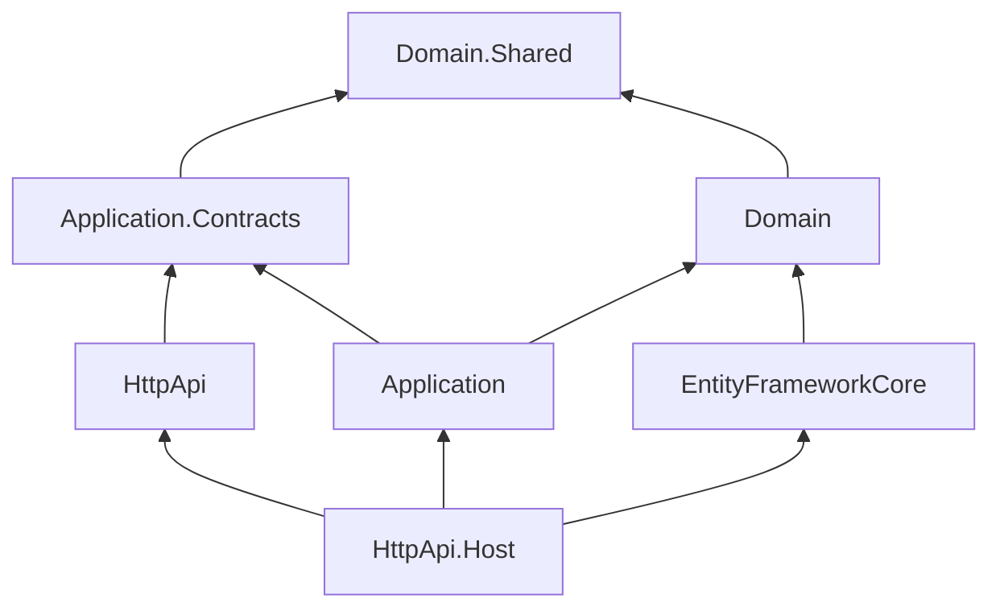

---

# Application Flow

## User Journey

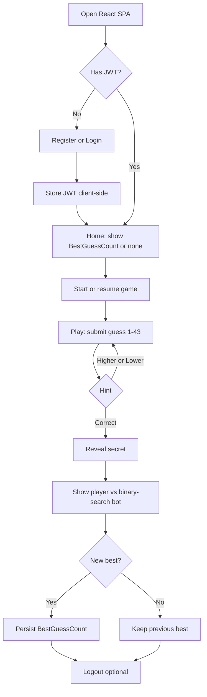

---

# Domain Model

The game is modeled as a domain aggregate rather than as CRUD-only database operations.

## User

The ABP Identity user is extended with:

| Field            | Type   | Purpose                              |
| ---------------- | ------ | ------------------------------------ |
| `BestGuessCount` | `int?` | Lowest number of guesses used to win |

The score is updated only after a successful game.

```text
BestGuessCount == null
    → User has never won

Current GuessCount < BestGuessCount
    → Update best score

Current GuessCount >= BestGuessCount
    → Keep existing score
```

---

## Game Aggregate

| Field                            | Type        | Description                      |
| -------------------------------- | ----------- | -------------------------------- |
| `Id`                             | `Guid`      | Game identifier                  |
| `UserId`                         | `Guid`      | Game owner                       |
| `SecretNumber`                   | `int`       | Server-side secret, range 1–43   |
| `GuessCount`                     | `int`       | Number of accepted guesses       |
| `Status`                         | enum        | `InProgress`, `Won`, `Abandoned` |
| `BotGuessCount`                  | `int`       | Binary-search bot result         |
| `ConcurrencyStamp` / row version | string/byte | Optimistic concurrency           |
| `CreationTime`                   | `DateTime`  | Creation timestamp               |

### Core invariant

> A user can have at most one `InProgress` game.

Starting a game therefore resumes the existing game rather than creating multiple active games.

---

## Guess Entity

Every accepted guess is persisted as a business record.

| Field            | Type       | Description                           |
| ---------------- | ---------- | ------------------------------------- |
| `Id`             | `Guid`     | Guess identifier                      |
| `GameId`         | `Guid`     | Parent game                           |
| `GuessNumber`    | `int`      | 1-based guess sequence                |
| `Value`          | `int`      | Player's selected number              |
| `Hint`           | enum       | `Higher`, `Lower`, `Correct`          |
| `IdempotencyKey` | `string?`  | Prevents duplicate request processing |
| `CreationTime`   | `DateTime` | Timestamp                             |

This is deliberately different from application logs.

**Serilog records operational flow; `Guess` records business history.**

Every accepted guess must produce exactly one durable `Guess` record within the same unit of work as the game update.

---

## Entity Relationship

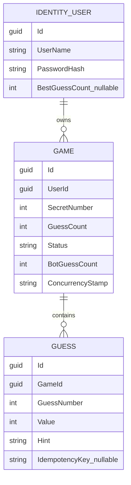

---

# Game Rules

## Starting a Game

1. Check whether the user already has an active game.
2. If one exists, return it.
3. Otherwise generate a random secret from `1..43`.
4. Calculate the binary-search bot result.
5. Persist the game as `InProgress`.
6. Never return the secret to the client.

## Recording a Guess

A guess must:

* Belong to the authenticated user.
* Belong to an `InProgress` game.
* Be within `1..43`.
* Respect idempotency.
* Not duplicate an existing value.

For a new valid guess:

1. Increment `GuessCount`.
2. Persist a `Guess` entity.
3. Compare the guess with the secret.
4. Return `Higher`, `Lower`, or `Correct`.
5. If correct, transition the game to `Won`.
6. Update `BestGuessCount` when appropriate.

---

## Guess Decision Flow

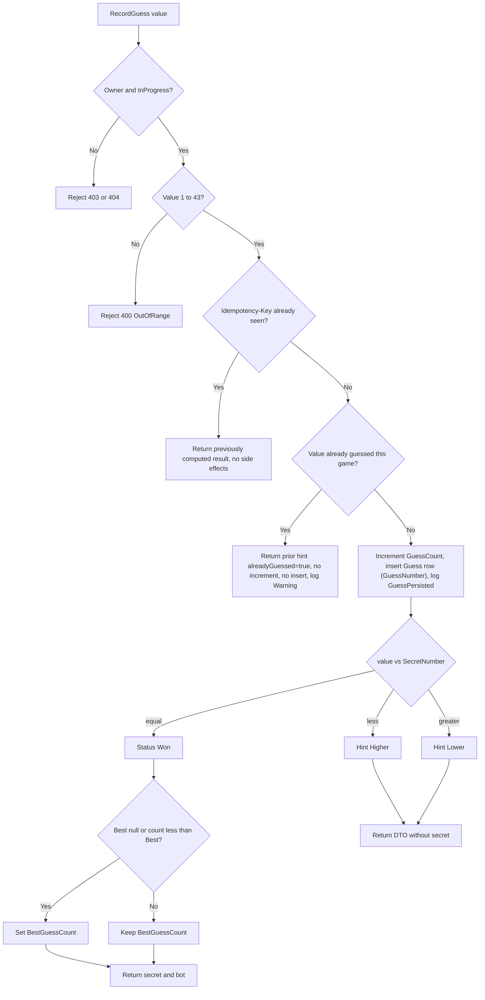

---

# Game State

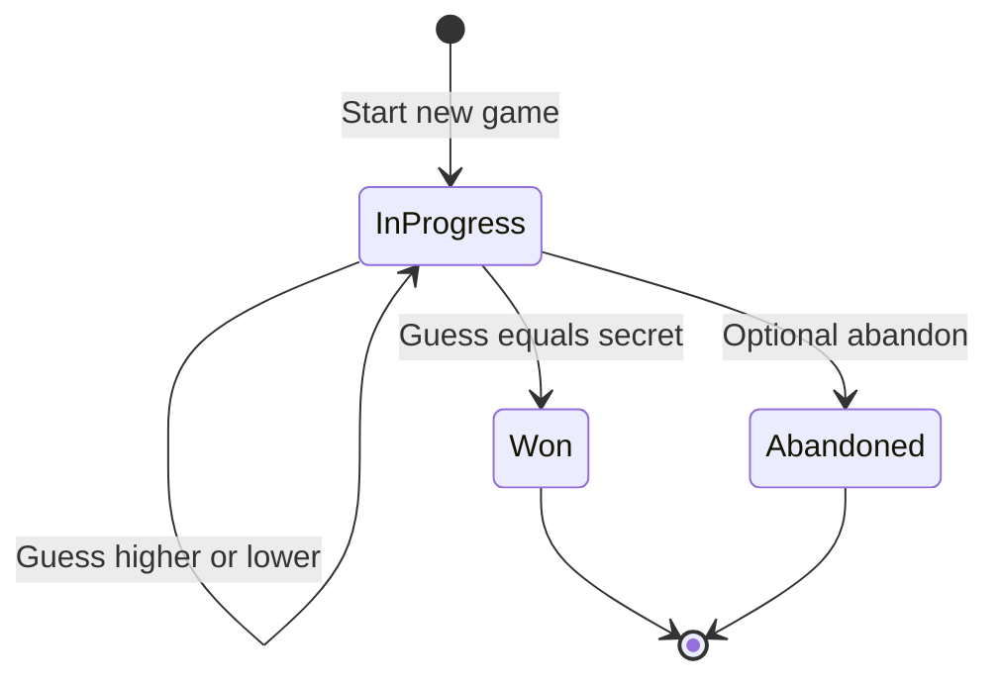

---

# Binary-Search Bot

The bot uses a deterministic binary-search algorithm over the inclusive range `1..43`.

```text
low = 1
high = 43
count = 0

while low <= high:
    mid = (low + high) / 2
    count++

    if mid == secret:
        return count

    if mid < secret:
        low = mid + 1
    else:
        high = mid - 1
```

The bot is:

* Deterministic.
* Pure.
* Independent of infrastructure.
* Easy to unit test.
* Executed before persistence so that the database transaction remains short.

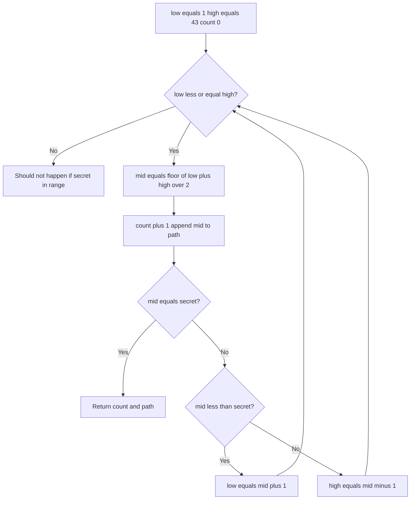

---

# REST API

The game API is authenticated using JWT.

> Endpoint names below represent the intended API contract. ABP conventional routing may produce slightly different concrete routes depending on configuration.

## Account

| Operation | Description                                       |
| --------- | ------------------------------------------------- |
| Register  | Creates a new Identity user                       |
| Login     | Obtains JWT through OpenIddict                    |
| Logout    | Removes client-side authentication state          |
| Profile   | Returns authenticated user profile and best score |

## Game

| Method | Endpoint                     | Description                    |
| ------ | ---------------------------- | ------------------------------ |
| `POST` | `/api/app/game`              | Start or resume current game   |
| `GET`  | `/api/app/game/current`      | Retrieve active game           |
| `POST` | `/api/app/game/{id}/guess`   | Submit a guess                 |
| `GET`  | `/api/app/game/{id}/guesses` | Retrieve ordered guess history |

### Guess Request

```json
{
  "value": 20
}
```

### Required Headers

```http
Authorization: Bearer <JWT>
X-Correlation-Id: <GUID>
Idempotency-Key: <GUID>
```

---

## API Response Semantics

| Scenario                     | HTTP Status |
| ---------------------------- | ----------: |
| Validation failure           |       `400` |
| Not authenticated            |       `401` |
| Not owner                    |       `403` |
| Game not found / unavailable |       `404` |
| Concurrency conflict         |       `409` |
| Rate limit exceeded          |       `429` |
| Successful operation         |       `200` |

ABP problem-details responses should expose the correlation ID through the response header and/or error payload.

---

# API Request Flow

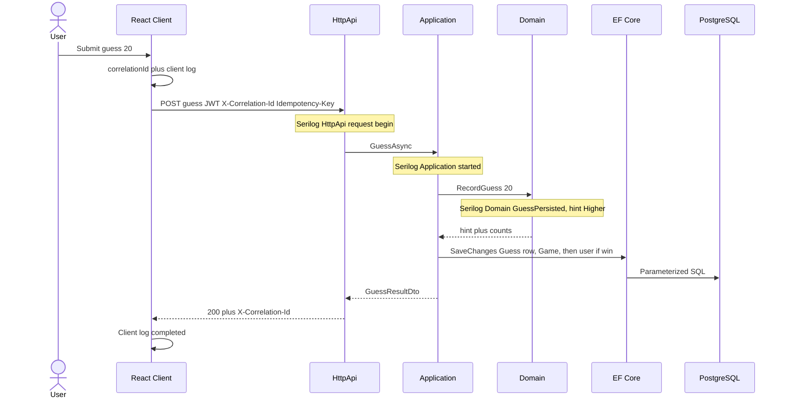

---

# Login and Profile Flow

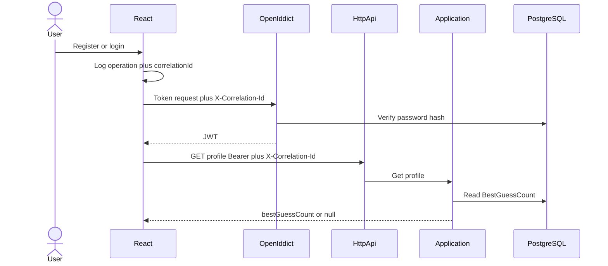

---

# React Client

The React SPA contains four primary user experiences:

1. **Register / Login**
2. **Authenticated Home**
3. **Game Play**
4. **Game Result**

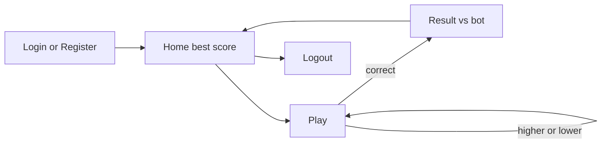

## Client Responsibilities

The React client is responsible for:

* Rendering game state.
* Capturing user input.
* Calling the REST API.
* Managing authentication state.
* Sending correlation IDs.
* Displaying higher/lower hints.
* Displaying best score.
* Displaying the final player-vs-bot result.
* Showing user-friendly errors.

The client must **not** be responsible for enforcing business rules.

Server-side validation remains authoritative.

---

# Authentication and Authorization

The application uses:

```text
React
   │
   │ Authentication request
   ▼
OpenIddict
   │
   │ JWT
   ▼
React
   │
   │ Authorization: Bearer <token>
   ▼
ABP API
   │
   ▼
Application Services
```

## Security Principles

* Passwords are never stored in plain text.
* Only password hashes are persisted.
* Game endpoints require authentication.
* Ownership is validated server-side.
* The secret number remains server-side until the game is won.
* Tokens and passwords are never written to logs.
* CORS is configured as an allow-list.
* Production secrets are supplied through environment configuration.

---

# Security

Security is intentionally handled at the application level rather than assuming that an external cloud platform will solve every problem.

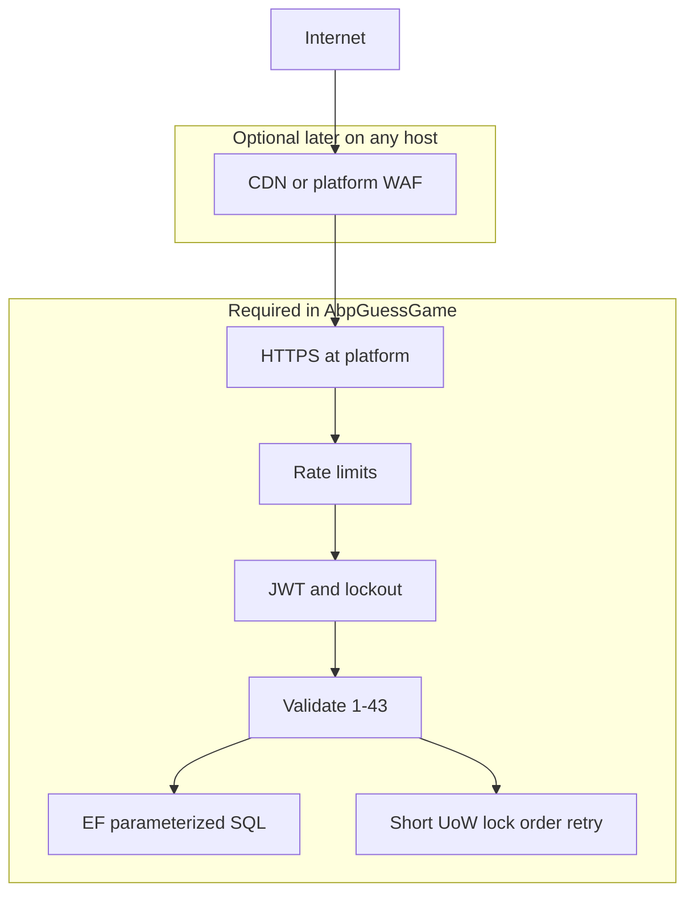

## Authentication Protection

Default application policy:

* 5 failed login attempts.
* 5-minute account lockout.
* JWT protection on game APIs.
* CORS allow-list.
* HTTPS in production.

## Rate Limiting

| Endpoint      |              Limit | Scope              |
| ------------- | -----------------: | ------------------ |
| Login/token   |  5 requests/minute | IP + username      |
| `POST /guess` | 20 requests/minute | Authenticated user |
| `POST /game`  |  5 requests/minute | Authenticated user |

Excessive requests return:

```http
429 Too Many Requests
Retry-After: <seconds>
```

The architecture explicitly distinguishes application-level abuse protection from volumetric DDoS mitigation, which belongs at the platform/network layer.

---

# PostgreSQL Concurrency and Deadlock Protection

The application follows a consistent unit-of-work strategy.

### Rules

1. One ABP unit of work per HTTP request.
2. Update the `Game` and `Guess` first.
3. Update `BestGuessCount` afterward.
4. Calculate the bot result before persistence.
5. Never perform HTTP calls inside the transaction.
6. Use optimistic concurrency.
7. Retry PostgreSQL deadlocks (`40P01`) with limited jittered retries.
8. Index active-game lookups by user and status.

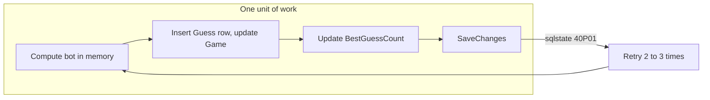

---

# SQL Injection Protection

Normal database access uses EF Core LINQ and parameterized queries.

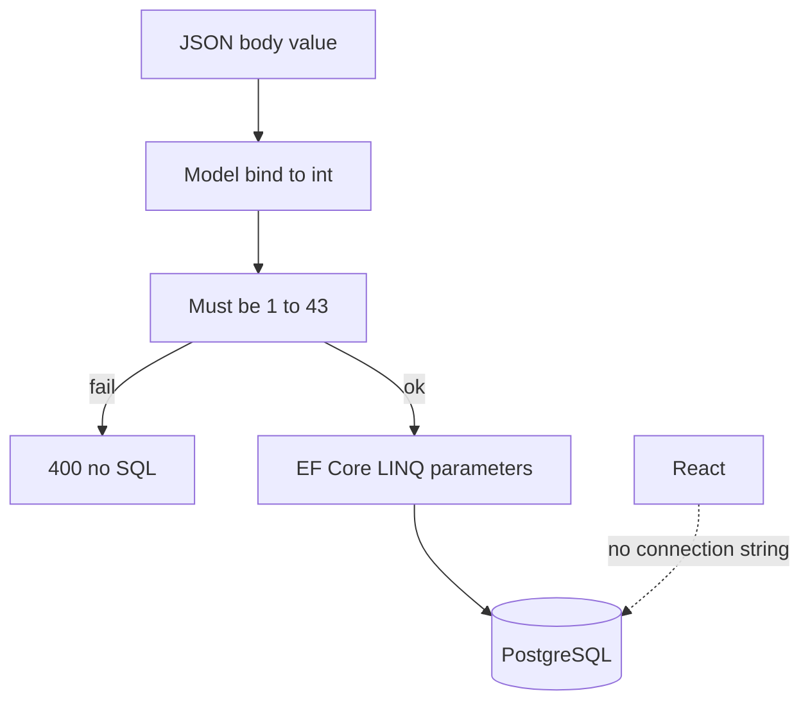

The application avoids:

* String-concatenated SQL.
* Database access from React.
* Database credentials in the SPA.
* Unvalidated game input.

---

# Game Integrity

The following invariants are enforced server-side:

* Secret remains hidden while a game is active.
* Guess values must be between `1` and `43`.
* Only the owner can operate on a game.
* Only `InProgress` games accept guesses.
* Duplicate guesses do not increment the score.
* Idempotent retries do not create duplicate guesses.
* Best score changes only after a successful win.
* A winning game has at least one accepted guess.
* Only one active game exists per user.

---

# Observability and Correlation

Observability is designed around a single correlation identifier.

```text
CorrelationId
     │
     ├── React
     │
     ├── HttpApi
     │
     ├── Application
     │
     ├── Domain
     │
     └── Infrastructure
```

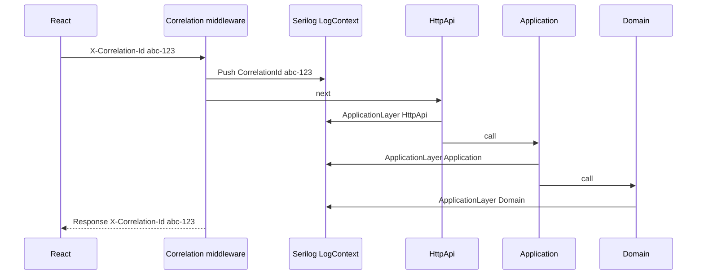

---

## Logging Architecture

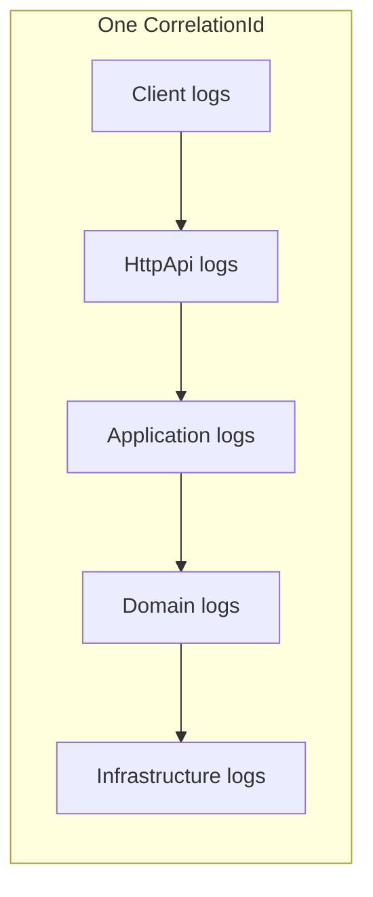

Each server log should identify its application layer:

* `Client`
* `HttpApi`
* `Application`
* `Domain`
* `Infrastructure`

This makes it possible to filter a single business operation across all layers.

---

## Logging Responsibilities

### Client

Typical events:

* Operation started.
* HTTP request.
* HTTP response.
* Operation failed.

### HttpApi

Typical events:

* Request started.
* Validation failure.
* Request completed.
* Unhandled exception.

### Application

Typical events:

* `GuessAsync started`
* `Game loaded`
* `Guess recorded`
* `Best score updated`
* `GuessAsync completed`
* Authorization failure.
* Deadlock retry.

### Domain

Typical events:

* `Game.Created`
* `Game.GuessRecorded`
* `Game.GuessPersisted`
* `Game.DuplicateGuessIgnored`
* `Game.Won`
* `Game.RejectedGuess`
* `BestGuessCount.Changed`

### Infrastructure

Typical events:

* EF save failure.
* PostgreSQL deadlock retry.
* EF persistence diagnostics.

---

# Logging and Sensitive Data

The following must **never** be logged:

* Passwords.
* JWT/access tokens.
* Cookies.
* Connection strings.
* Secret number while a game is active.
* Full login/register request bodies.

Safe operational fields include:

* User ID.
* Game ID.
* Guess value.
* Hint.
* Guess count.
* Correlation ID.

---

# Serilog vs Audit Logging vs Business History

The application deliberately separates three forms of observability:

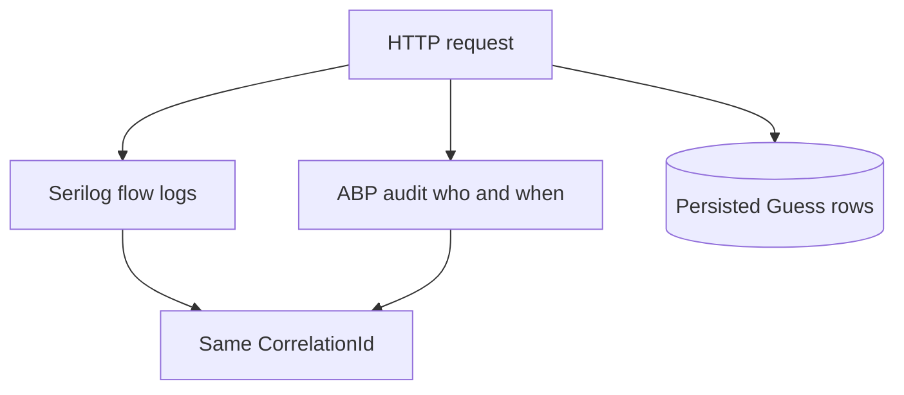

| Mechanism      | Purpose                                 |
| -------------- | --------------------------------------- |
| Serilog        | Operational flow and troubleshooting    |
| ABP Audit Logs | Accountability and user/action auditing |
| `Guess` table  | Durable business history                |

---

# Configuration

The application follows a 12-factor-style configuration approach.

| Setting                      | Purpose                  |
| ---------------------------- | ------------------------ |
| `ConnectionStrings__Default` | PostgreSQL connection    |
| `App__CorsOrigins`           | Allowed React origins    |
| `AuthServer__Authority`      | Authentication authority |
| `ASPNETCORE_ENVIRONMENT`     | Runtime environment      |
| `Serilog__MinimumLevel`      | Logging verbosity        |

### Secrets

Never commit secrets to source control.

Use:

* Environment variables.
* Local `.env` files where appropriate.
* Platform configuration variables.
* Azure App Settings.
* Secret stores provided by the hosting platform.

---

# Health and Production Infrastructure

The application exposes a health endpoint:

```http
GET /health
```

Production environments should also use:

* HTTPS.
* Forwarded headers when running behind a reverse proxy.
* Appropriate security headers.
* Protected or disabled Swagger in production.
* Platform-managed secrets.
* Platform-level WAF/CDN/DDoS protection where required.

---

# Local Development

## Prerequisites

Install:

* [.NET 10 SDK](https://dotnet.microsoft.com/download/dotnet)
* [Node.js](https://nodejs.org/)
* PostgreSQL or Docker
* ABP CLI

Verify the environment:

```bash
dotnet --version
node --version
npm --version
abp --version
```

---

## Install Frontend Dependencies

From the repository root:

```bash
abp install-libs
```

If the React application uses npm directly:

```bash
cd react
npm install
```

---

## Start PostgreSQL

Using Docker Compose:

```bash
docker compose up -d
```

Verify PostgreSQL is available before starting the backend.

---

## Configure the Database

Configure the PostgreSQL connection through the application's configuration.

Example:

```json
{
  "ConnectionStrings": {
    "Default": "Host=localhost;Port=5432;Database=AbpGuessGame;Username=postgres;Password=your-password"
  }
}
```

For production, prefer environment variables instead of committing credentials to `appsettings.json`.

---

# Database and Migrations

The `DbMigrator` application is responsible for:

* Applying EF Core migrations.
* Creating/updating the database schema.
* Running required database seed operations.

Run the migrator before the first application startup and whenever new migrations are introduced.

Typical workflow:

```bash
dotnet run --project src/AbpGuessGame.DbMigrator
```

If your repository uses a different DbMigrator project location, use the corresponding project path.

---

# Running the Application

## Backend

Run the ABP host:

```bash
dotnet run --project src/AbpGuessGame.HttpApi.Host
```

## React

Run the frontend:

```bash
cd react
npm run dev
```

The development environment then follows this model:

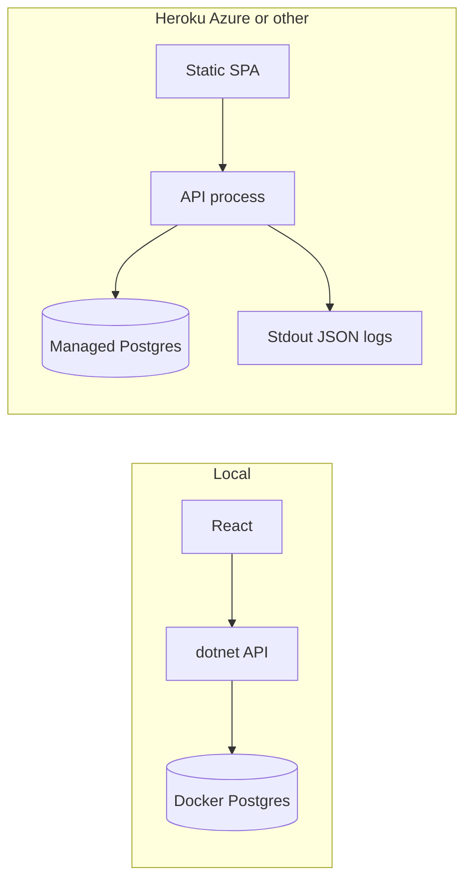

The architecture is intentionally cloud-agnostic: the same application can run locally, in containers, on Azure, Heroku, or another Docker-capable host.

---

# OpenIddict Signing Certificate

For production deployments, use production-grade signing and encryption certificates.

Development certificates can be generated with:

```bash
dotnet dev-certs https -v -ep openiddict.pfx -p <your-password>
```

**Do not use a real production password in source control or documentation.**

Production deployments should use dedicated certificates for signing and encryption, separate from HTTPS certificates.

---

# Testing Strategy

Testing is treated as a first-class part of the architecture.

The strategy follows a test pyramid:

```mermaid
flowchart TB
  subgraph Few["Fewer, slower"]
    E2E[Manual plus optional Playwright]
    Api[HttpApi integration tests]
  end

  subgraph Mid["Application tests"]
    AppT[AppService tests with mocked repos]
  end

  subgraph Many["Many, fast, no database"]
    DomT[Domain unit tests]
    BotT[BinarySearchBot unit tests]
    ReactT[React unit tests Vitest]
  end

  E2E --> Api --> AppT --> DomT
  AppT --> ReactT
  DomT --> BotT
```

## Test Layers

| Layer       | Technology                   | Purpose                       |
| ----------- | ---------------------------- | ----------------------------- |
| Domain      | xUnit + Shouldly             | Business rules and invariants |
| Application | ABP test base + mocks/fakes  | Use-case behavior             |
| EF/API      | Integration tests            | Persistence and HTTP behavior |
| React       | Vitest + Testing Library     | UI behavior                   |
| E2E         | Manual / optional Playwright | End-to-end validation         |

---

# Domain Test Coverage

Core rules include:

* Secret boundaries `1` and `43`.
* Invalid secret rejection.
* Higher/lower hints.
* Winning guesses.
* Guess count.
* Best-score calculation.
* Duplicate guesses.
* Idempotent requests.
* Guess-after-win rejection.
* Binary-search algorithm.
* Secret generator abstraction.

The domain should remain deterministic during tests by injecting the secret-number generator rather than creating random values directly inside the aggregate.

---

# API and Integration Tests

Critical API scenarios include:

```text
POST guess without JWT
    → 401

POST guess with value 0
    → 400

POST guess with invalid JSON type
    → 400

POST guess with correlation ID
    → response echoes correlation ID

POST same guess with same idempotency key
    → same result, one Guess row

GET guesses
    → ordered persisted history

Rate limit exceeded
    → 429 + Retry-After
```

Integration tests should preferably use a real PostgreSQL engine when validating PostgreSQL-specific behavior.

Testcontainers PostgreSQL is an appropriate option for integration testing.

---

# React Tests

Important UI scenarios include:

* No best score.
* Existing best score.
* Higher hint.
* Lower hint.
* Correct guess.
* Secret displayed only after winning.
* Duplicate guess message.
* Bot comparison.
* Correlation ID generation.
* Idempotency key generation.
* Input validation.

---

# Testing Commands

Backend:

```bash
dotnet test
```

Domain-focused tests:

```bash
dotnet test --filter FullyQualifiedName~Domain.Tests
```

Frontend:

```bash
npm --prefix react test
```

---

# Engineering Decisions

## 1. Modular Monolith over Microservices

The domain does not justify distributed infrastructure.

## 2. Domain Rules on the Server

The browser is not trusted with business-critical decisions.

## 3. Persistent Guess History

A guess is a business event and must be persisted, not represented only by logs.

## 4. Idempotent Guess Requests

Network retries and double-clicks must not inflate the score.

## 5. Optimistic Concurrency

Concurrent requests must not silently corrupt game state.

## 6. Correlation IDs

A single operation should be traceable across client, API, application, domain, and infrastructure.

## 7. Cloud Agnostic

The application does not require AWS-specific services.

## 8. Deterministic Domain Tests

Randomness is injected rather than embedded in business logic.

## 9. Server-Side Secret Protection

The secret number is never exposed while a game is in progress.

## 10. Avoid Premature Distributed Complexity

RabbitMQ, Redis, API gateways, Kubernetes, and other infrastructure can be introduced later when there is a demonstrated business or scaling requirement.

---

# Out of Scope

The following are intentionally **not required for v1**:

* Microservices.
* API Gateway.
* YARP/Ocelot.
* RabbitMQ.
* Redis as a mandatory dependency.
* AWS Shield.
* AWS WAF.
* AWS CloudFront.
* AWS X-Ray.
* AWS Secrets Manager.
* RDS Proxy.
* Public leaderboards.
* Chat.
* Multiplayer sockets.
* Terraform/CDK.

These can be considered later if the business requirements justify them.

---

# Player vs Bot

The bonus flow uses the same server-generated secret for both participants.

```mermaid
flowchart LR
  Secret[Same SecretNumber]
  Player[Player guesses]
  Bot[Bot binary search]

  Secret --> Player
  Secret --> Bot

  Player --> Cmp{Compare guess counts}
  Bot --> Cmp

  Cmp --> A[Player less or equal bot: beat or match]
  Cmp --> B[Player greater: bot was faster]
```

The result can communicate:

* Player guess count.
* Bot guess count.
* Whether the player beat the bot.
* Optional bot search path.
* Player's persisted guess history.

---

# Implementation Roadmap

The intended implementation sequence is:

1. Establish documentation and project structure.
2. Configure ABP API and PostgreSQL.
3. Implement Identity and authentication.
4. Extend the user with `BestGuessCount`.
5. Implement Game and Guess domain entities.
6. Add EF Core mappings and migrations.
7. Implement Application Services.
8. Expose REST APIs.
9. Implement React authentication.
10. Implement React game experience.
11. Add Serilog and correlation middleware.
12. Add rate limiting and concurrency protection.
13. Add security hardening.
14. Complete automated tests.
15. Document deployment/runbook procedures.

```mermaid
flowchart TD
  P[Plan accepted] --> D[docs steps markdown]
  D --> B[Bootstrap API and Postgres]
  B --> I[Identity auth]
  I --> G[Game domain and EF]
  G --> UT[Domain unit tests]
  UT --> A[Application and HttpApi]
  A --> AT[Application and API tests]
  AT --> L[Serilog correlation]
  L --> R[React auth and game]
  R --> RT[React unit tests]
  RT --> S[Rate limit deadlock retry]
  S --> H[Runbook Heroku Azure]
```

---

# Documentation

The architecture documentation is maintained separately in:

```text
DOCUMENTATION.md
```

It acts as the detailed architecture and design source of truth.

The project also defines step-specific documentation:

| Document                     | Purpose                               |
| ---------------------------- | ------------------------------------- |
| `01-bootstrap.md`            | ABP solution and PostgreSQL setup     |
| `02-identity-auth.md`        | Registration, login, JWT and CORS     |
| `03-game-domain.md`          | Game domain and business rules        |
| `04-game-application-api.md` | Application services and REST API     |
| `05-react-auth.md`           | React authentication                  |
| `06-react-game.md`           | React game experience                 |
| `07-serilog-correlation.md`  | Logging and correlation               |
| `08-security-hardening.md`   | Security, rate limits and concurrency |
| `09-runbook.md`              | Running and deployment                |
| `10-unit-tests.md`           | Automated testing                     |

The documentation process requires every implementation step to define its goal, tasks, logging/security considerations, tests, and completion criteria.

---

# Acceptance Checklist

| Requirement                  | Implementation                  |
| ---------------------------- | ------------------------------- |
| React full-stack application | React + TypeScript              |
| PostgreSQL                   | EF Core + PostgreSQL            |
| Registration                 | ABP Identity                    |
| Login                        | OpenIddict/JWT                  |
| Logout                       | Client authentication lifecycle |
| Credentials                  | Secure password hashes          |
| Random secret                | Server-generated `1..43`        |
| Higher/lower hints           | Domain rule                     |
| Best score                   | `BestGuessCount`                |
| Score shown after login      | Profile/Home                    |
| Binary-search bot            | Domain algorithm                |
| Persistent guesses           | `Guess` entity                  |
| Idempotency                  | `Idempotency-Key`               |
| Correlation                  | `X-Correlation-Id`              |
| Structured logs              | Serilog                         |
| Audit logging                | ABP Audit Logging               |
| Rate limiting                | Application-level               |
| SQL injection protection     | EF Core parameterization        |
| Deadlock handling            | PostgreSQL `40P01` retry        |
| Automated testing            | Domain/Application/API/React    |
| Cloud portability            | Cloud-agnostic design           |
| Architecture diagrams        | Mermaid                         |

The architecture document maps these capabilities directly against the original application requirements.

---

# Architecture Summary

At a high level, the solution follows this architecture:

```text
                         ┌─────────────────────┐
                         │      React SPA      │
                         │  TypeScript / Vite  │
                         └──────────┬──────────┘
                                    │
                             HTTPS + JWT
                                    │
                           X-Correlation-Id
                                    │
                         ┌──────────▼──────────┐
                         │   ABP HTTP API      │
                         │ Auth / CORS / Rate  │
                         │ Limit / Serilog     │
                         └──────────┬──────────┘
                                    │
                         ┌──────────▼──────────┐
                         │    Application      │
                         │    Use Cases / UoW  │
                         └──────────┬──────────┘
                                    │
                         ┌──────────▼──────────┐
                         │       Domain        │
                         │ Game / Guess / Bot  │
                         │ Business Invariants │
                         └──────────┬──────────┘
                                    │
                         ┌──────────▼──────────┐
                         │     EF Core         │
                         │ Persistence / ORM   │
                         └──────────┬──────────┘
                                    │
                         ┌──────────▼──────────┐
                         │     PostgreSQL      │
                         │ Identity / Games /  │
                         │ Guess History       │
                         └─────────────────────┘
```

This structure provides a clean separation between **presentation, API, application orchestration, domain behavior, and persistence**, while keeping the deployment model intentionally simple.

---

# Repository

Source code:

[AbpGuessGame on GitHub](https://github.com/MostafaMonib/AbpGuessGame)

---

# Additional Resources

* [ABP Framework](https://abp.io/)
* [ABP Domain Driven Design](https://abp.io/docs/latest/framework/architecture/domain-driven-design)
* [ABP Application Startup Template](https://abp.io/docs/latest/solution-templates/layered-web-application)
* [OpenIddict](https://documentation.openiddict.com/)
* [ASP.NET Core](https://learn.microsoft.com/aspnet/core)
* [Entity Framework Core](https://learn.microsoft.com/ef/core/)
* [PostgreSQL](https://www.postgresql.org/)
* [React](https://react.dev/)
* [TypeScript](https://www.typescriptlang.org/)

---

## Architecture Principles

The project follows these core principles:

> **Keep the domain authoritative. Keep the client untrusted. Keep boundaries explicit. Keep infrastructure proportional to the problem. Make operations observable. Make business history durable. Make tests deterministic.**

That is the architectural foundation of **AbpGuessGame**.
